# Lesson 2
## Примітивні типи
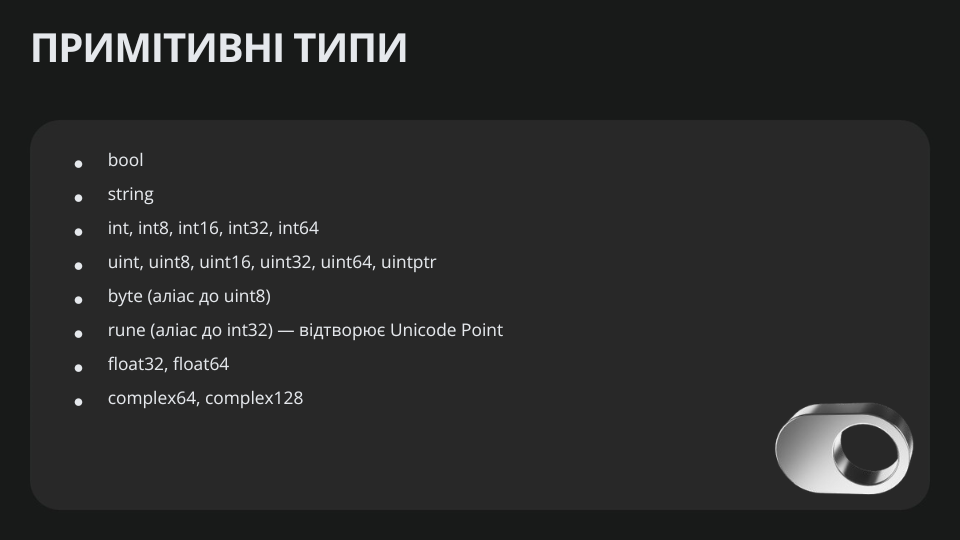

Примітивні типи називаються такими, оскільки вони є базовими, фундаментальними будівельними блоками будь-якої програми, написаної на мові програмування. Вони не визначаються через інші типи і є найпростішими формами даних, які безпосередньо підтримуються процесором або середовищем виконання (runtime)

### Числові типи
1. Цілі числа **(integers)**:
	- **int**: ціле число, розмір залежить від архітектури (32 або 64 біти).
	- **int8**: 8-бітне ціле число зі знаком (від -128 до 127).
	- **int16**: 16-бітне ціле число зі знаком (від -32,768 до 32,767).
	- **int32**: 32-бітне ціле число зі знаком (від -2,147,483,648 до 2,147,483,647).
	- **int64**: 64-бітне ціле число зі знаком (від -9,223,372,036,854,775,808 до 9,223,372,036,854,775,807).
	- **uint**: ціле число без знака, розмір залежить від архітектури (32 або 64 біти).
	- **uint8**: 8-бітне ціле число без знака (від 0 до 255).
	- **uint16**: 16-бітне ціле число без знака (від 0 до 65,535).
	- **uint32**: 32-бітне ціле число без знака (від 0 до 4,294,967,295).
	- **uint64**: 64-бітне ціле число без знака (від 0 до 18,446,744,073,709,551,615).
	- **uintptr**: тип для зберігання розмірів або адрес (корисний для роботи з небезпечною пам’яттю).

2. Числа з плаваючою комою **(floating-point numbers)**:
	- **float32**: 32-бітне число з плаваючою комою.
	- **float64**: 64-бітне число з плаваючою комою.

3. Комплексні числа:
	- **complex64**: комплексне число з 32-бітною дійсною та уявною частинами.
	- **complex128**: комплексне число з 64-бітною дійсною та уявною частинами.
### Логічний тип
 - **bool**: може бути тільки `true` або `false`.
### Рядки **(string)**
- **string**: рядок символів у кодуванні UTF-8.

### Байти та руни
1. **byte**: псевдонім для `uint8`, використовується для представлення окремих байтів.
2. **rune**: псевдонім для `int32`, використовується для представлення одного символу `Unicode`.

### Спеціальні типи
1. **error**: вбудований інтерфейс для роботи з помилками.
2. **nil**: особливе значення, яке вказує на відсутність значення для посилань, каналів, мап, слайсів та функцій.

## Функції 
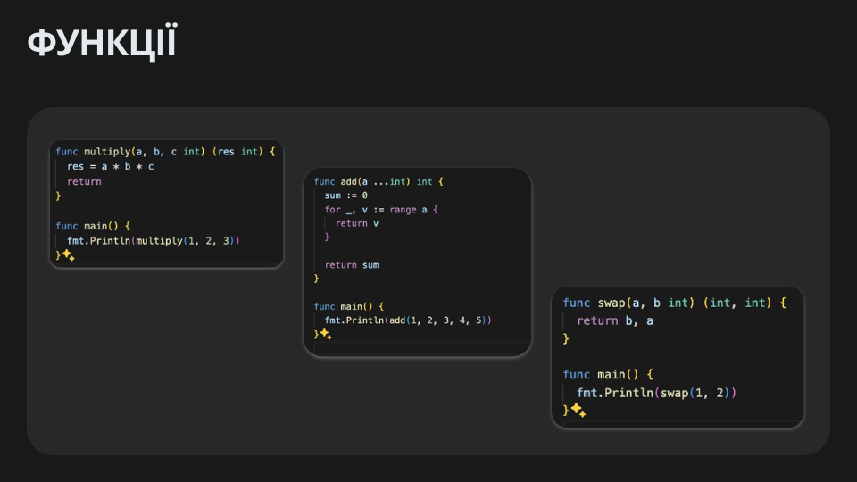
Функція в Go визначається ключовим словом `func`. Її синтаксис виглядає так
```go
func Назва(Аргументи) (Повертаєме_значення) {
    // Тіло функції
}
```
### Приклади простих функцій
#### 1. **Функція без аргументів і без повернення значення:**
```go
func SayHello() {
    fmt.Println("Привіт, світ!")
}
```
#### 2. **Функція з аргументами::**
```go
func Add(a int, b int) int {
    return a + b
}
```
#### 3. **Функція з кількома значеннями, що повертаються::**
```go
func Divide(a, b int) (int, error) {
    if b == 0 {
        return 0, fmt.Errorf("Ділення на нуль!")
    }
    return a / b, nil
}
```

#### 4. **Функції першого класу**

У Go функції є "першокласними об'єктами", тобто ви можете:
- Присвоювати їх змінним:
```go
add := func(a, b int) int {
    return a + b
}
fmt.Println(add(2, 3)) // 5

```
- Передавати їх як аргументи в інші функції
```go
func ApplyOperation(a, b int, operation func(int, int) int) int {
    return operation(a, b)
}
fmt.Println(ApplyOperation(3, 4, add)) // 7
```
#### 5. **Анонімні функції**
Анонімні функції не мають імені:
```go
func() {
    fmt.Println("Анонімна функція")
}()

```
#### 6. **Вкладені функції** (`defer`) 
Ключове слово `defer` дозволяє відкласти виконання функції до завершення поточної:
```go
func OpenFile() {
    file, err := os.Open("example.txt")
    if err != nil {
        fmt.Println(err)
        return
    }
    defer file.Close() // Закриє файл після завершення функції
    // Робота з файлом
}
```

#### 7. **Рекурсія**
Go підтримує рекурсію, тобто функція може викликати сама себе
```go
func Factorial(n int) int {
    if n == 0 {
        return 1
    }
    return n * Factorial(n-1)
}
```
#### 8. **Функції як методи**
Функції можуть бути методами, якщо вони визначені для певного типу
```go
type Rectangle struct {
    Width, Height int
}

func (r Rectangle) Area() int {
    return r.Width * r.Height
}
```

### Нюанси та Особливості 
1. Якщо у нас функція приймає декілька аргументів які мають один і той самий тип `(var a int, var b int, var c int)` і ідуть підряд то нам достатньо їх 1н раз описати останнім значенням

**Do this**
```go
func multiply(a, b, c int) (res int) {
	res = a * b * c
	return
}
```
**Instead of this**
```go
func multiply(a int, b int, c int) (res int) {
	res = a * b * c
	return
}
```

### 2. В Go є можливість передавати варіативну кількість аргументів. 

У прикладі наведеному нижче у нас є функція add в якої на вхід 1н аргумнт `a`. Який насправді перетворюється в масив. А передавати в цю функцію можна як завгодно багато елементів типу `int`. Подібні конструкції є і у інших мовах.

Якщо з опціональними значенями зазвичай використовуються поінтери і повертається `nil` або якесь дефолтне значення. Тобно скільки `return` типів ми задефайнили стільки ми й маємо повернути

```go
func Sum(numbers ...int) int {
    sum := 0
    for _, num := range numbers {
        sum += num
    }
    return sum
}
fmt.Println(Sum(1, 2, 3, 4)) // 10
```
Прикдад масиву
```go
var arr [5]int
arr := [5]int{1, 2, 3, 4, 5}
```
3. В Go є можливість повертати декілька значеннь. Це не означає що у GO є окремий тип типу `tuple` як в інших мовах. але функція може повертати декілька значеннь.
```go
func swap(a, b int) (int, int) {
	return b, a
}

func main() {
	fmt.Println(swap(1, 2))
}
```
4. `return` можуть бути іменовані. І нам не завжди потрібно їх ініціалізувати. Тобто я ми проіменували якийсь `return` тип то це вже задефайнена зміна, нам достатньо присвоїти туди якесь значення, і в результаті функція поверне саме це значення. 

example with `res`.
```go
func RectangleArea(width, height int) (area int) {
    area = width * height
    return // Не потрібно вказувати значення явно, бо `area` уже визначено
}
```

## Змінні 
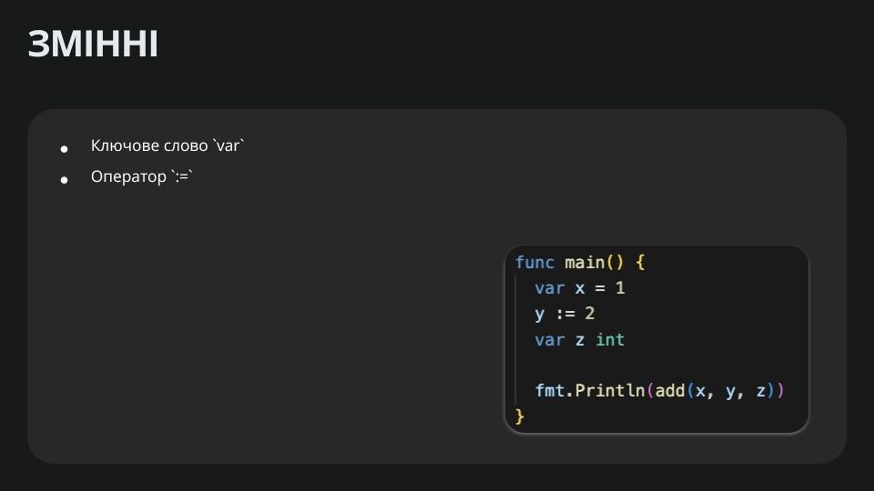
1. Змінні обь'являються ключовим словом `var`. Потім зазвичай їде аннотація самого типу `var z int`. Вона з самого початку ініціалізується дефолтним значененям. Для `bool` іде `false`, для `string` це `""`, для вcіх цисельних типів це `0`.
```go
var age int
var name string
```
- Одночасне оголошення й ініціалізація. Тут змінні одразу отримують початкові значення.
```go
var age int = 25
var name string = "John"
```
- Групове оголошення. Зручно, коли потрібно оголосити кілька змінних відразу
```go
var (
    count int     = 10
    title string  = "Go Developer"
    isOpen bool   = false
)
```
2. Коротке оголошення змінної через оператор `:=`

Go має спеціальний синтаксис короткого оголошення та ініціалізації змінної:
```go
age := 25
name := "John"
isOpen := true
```
- Використовується тільки у функціях. Зовні функцій `:=` застосувати не можна.
- Тип змінної виводиться автоматично на основі присвоєного значення `(інференція типів)`. Тобто якщо `x :=1` то це `int` а якщо ж `a :="text"` то це `string`

3. Присвоєння `(assignment)`

Коли змінна вже оголошена, ви можете змінити її значення оператором `=:`
```go
var age int
age = 30 // Присвоюємо після оголошення

// або
age := 25
age = 26
```

4. Іменування змінних
- Імена змінних у Go мають починатися з літери (англійської) або `_`.
- Іменування чутливе до регістру (велика/мала літера має значення).
- Для змінних, які мають бути доступні у інших пакетах (експортовані), імена потрібно починати з великої літери:

```go
var PublicVariable int // Експортована змінна
var privateVariable int // Неекспортована змінна (тільки в межах пакета)
```
## Глобальні змінні та константи
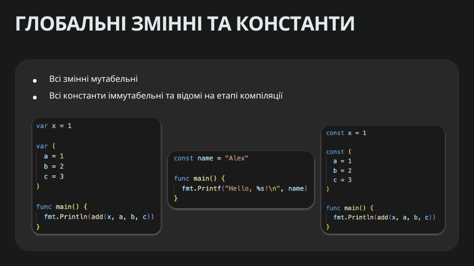
У Go немає окремого ключового слова глобальні `global` змінні, але є змінні на рівні пакета `package-level variables`. 
Вони оголошуються поза межами будь-яких функцій та можуть бути доступні у всьому пакеті. 
Якщо змінна експортована `починається з великої літери`, вона доступна і з інших пакетів.

Так само, для констант у Go використовується ключове слово `const`. 
Константи також можна оголошувати як на рівні пакета, так і всередині функцій.
### 1. Глобальні `пакетні` змінні
1. Оголошення
```go
package main

import "fmt"

// Глобальна змінна (тільки в межах цього пакета)
var version = "1.0.0"

// Експортована глобальна змінна (видна в інших пакетах, якщо імпортують цей пакет)
var PublicValue = 42

func main() {
    fmt.Println("Current version:", version)
    fmt.Println("Public value:", PublicValue)
}
```
- Змінна version доступна тільки в межах цього пакета, адже ім’я починається з малої літери.
- Змінна PublicValue доступна поза пакетом (у тому випадку, якщо імпортувати цей пакет і звернутися до неї як packageName.PublicValue).

2. Особливості використання глобальних змінних
- Оголошуються на рівні пакета `(тобто поза функціями)`.
- Зазвичай, за можливості, уникають використання глобальних змінних, оскільки вони ускладнюють підтримку коду та можуть призвести до неочікуваних побічних ефектів.
- Водночас, вони корисні для спільного доступу до загальних налаштувань або констант, що справді мають бути видимі в усій програмі.
### 2. Константи в Go
Константи оголошуються за допомогою ключового слова `const`. Вони мають бути відомі під час компіляції, тож не можуть обчислюватися динамічно під час виконання.
- Оголошення констант
```go
const PI = 3.14
const Greeting = "Hello"
```
- Тип константи може бути як явно вказаним, так і виведеним автоматично
```go
const message string = "Hi"
const number = 100
```
- Групове оголошення
```go
const (
    Country = "Ukraine"
    City    = "Kyiv"
    Code    = 44
)
```
- Використання `iota`
iota — спеціальний ідентифікатор у Go, який автоматично інкрементується (збільшується на 1) при кожному новому рядку оголошення константи в групі.

```go
const (
    A = iota // 0
    B        // 1
    C        // 2
)

const (
    _ = iota       // iota = 0, ігнорується "_"
    KB = 1 << (10 * iota) // 1 << (10 * 1) = 1024
    MB = 1 << (10 * iota) // 1 << (10 * 2) = 1048576
    GB = 1 << (10 * iota) // 1 << (10 * 3) = 1073741824
)
```


## Вказівники, `Pointers`, Поінтери.
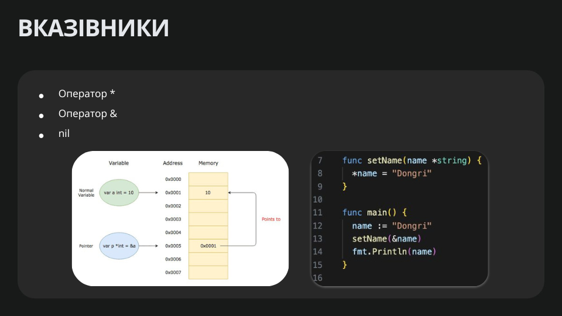

Що таке поінтер. Поінтер це по суті аддресса на якесь місце у пам'яті. Тобто поінтер на `int`, саме значення цього типу поінтер на `int` містить у собі аддресу самого `інта`

Для прикладу у нас є значення інтове яке лежить по аддресі 0x0001
```go
var a int = 10 // 0x0001 addres, in memory = 10
```
Є значення поінтер на `int`. І воно у собі містить не саме значення, а аддресу яка вказує на наше значення
```go
var p *int = &a // 0x0005 addres, in memory = 0x0001, equal to addres of a 
```
Дефолтне значення усіх поінтерів `nil`. Як і в `C` для того щоб взяти аддресу використовуємо амперсанд `&`. А щоб дістати значення використовуємо зірочку `*`.
### Для чого це загалом потрібно 
Загалом це використовується наприклад коли у нас є функція яка приймає багато параметрів або дуже важкий об'єкт. Щоб не копіювати повністю цей об'єкт  ми просто переєма адресу на цей об'єкт. Що в результаті просто якесь маленьке значення яке в собі зберігає лише аддресу. Це основна мотивація для чого взагалі поінтери існують.
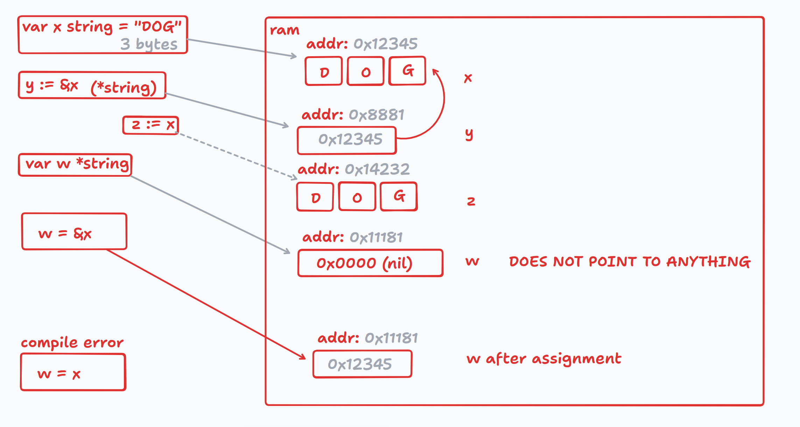

```go
func set(x *int) {
	*x = 2
}

func main() {
	x := 1
	fmt.Println(x) // 1
	set(&x)
	fmt.Println(x) // 2
}
```
У цьому прикладі
- `*int` - Це тип. Це такий самий тип як і всі інші типи. Тобто `*` завжди в `int` прописується
- `*x = 2` - Це коли ми вже хочемо задереференсити сам поінтер до значення `2`
- Тобто `(x *int)` значить те що ми у функцію передаєм вказівник на `int`

#### Тобто 
Тобто якщо ми зробимо ось так, не вказівник а просто `int` передамо. То тоді це значення скопіюється. А так тут у нас створиться `pointer` і передається сюди `pointer`
```go
func set(x int) {
	x = 2
}

func main() {
	x := 1
	fmt.Println(x) // 1
	set(x)
	fmt.Println(x) // 1
}
```
Тобто у випадку з 
```go
func set(x *int) {
	*x = 2
}
```
- Якщо ми будемо робити ось так `*x = 2` то буде змінюватись  саме значення. Якщо ж ось так, `*x = 2` то буде змінюватись аддреса
- Тобто у видадку з функцією `set` вона модифікує значення яке у неї надходить і нічого не повертає бо в неї навіть немає `return`. Вона змінює оригінальне значення яке в неї надходить. А надходить у нюю саме адресса, тобто посилання, вказівник на оригінальну перемінну.

```go
func set(x *int) {
	y := 3
	x = &y
}

func main() {
	x := 1
	fmt.Println(x) // 1
	set(&x)
	fmt.Println(x) // 1
}
```
Суть то й в тому що ми змінили `X`. Але `X` це **аддреса** `int`. А щоб доступитися до самого `int` то нам треба **дереференс** зробити **`*x = ...`**

### GPT Lecture about Pointers

#### 1. Що таке вказівник?
**Вказівник `pointer`** — це змінна, яка зберігає адресу пам’яті іншої змінної.
У Go (як і в багатьох інших мовах) кожна змінна десь “живе” в пам’яті комп’ютера, і цю “адресу” можна передавати й використовувати напряму.

Наприклад, якщо ви маєте змінну `x`, вказівник на `x` буде містити ***адресу в пам’яті*** цієї змінної, а не її значення.

#### 2. Навіщо потрібні вказівники?
- **Економія пам’яті та пришвидшення роботи**: Коли передаємо великі структури або масиви у функції, копіювання може бути затратним. Якщо ж передати *адресу* — Go не копіюватиме весь об’єкт, а напряму працюватиме з оригіналом.
- **Зміна оригінальних даних**: Якщо ми передаємо змінну в функцію як копію (тобто без вказівника), змінюється лише копія, і оригінал лишається незмінним. Якщо ж передати *вказівник*, функція може змінювати початкове значення, адже має доступ до тієї самої області пам’яті.

#### 3. Як оголосити і використовувати вказівники
1. Оператор `&` **(отримати адресу)**
- Щоб отримати вказівник на змінну, треба поставити перед нею символ `&`.
- Наприклад, `&x` означатиме “адреса змінної `x`”.
2. Оператор `*` **(звернутися за адресою)**
- Якщо ми маємо вказівник (наприклад, `p`), то `*p` означає “значення за адресою, що зберігається у змінній p”.
- Іншими словами, `*p` дає нам доступ до реальної змінної, на яку вказує `p`.
3. Тип вказівника
- Якщо `x` має тип `int`, то вказівник на `x` має тип `*int`.
- Аналогічно, вказівник на тип `string` буде `*string`, і так далі
#### 4. Приклад коду з поясненням
```go
package main

import "fmt"

func main() {
    x := 10
    fmt.Println("Початкове значення x =", x) // 10

    // p - це вказівник на x
    p := &x    // Записуємо в p адресу змінної x
    fmt.Println("Значення p (адреса в пам'яті) =", p) // 0xc00000a0e8
    fmt.Println("Значення, на яке вказує p =", *p) // 10

    // Змінимо x через p
    *p = 20
    fmt.Println("Нове значення x =", x)       // 20
    fmt.Println("Значення, на яке вказує p =", *p) // 20
}
```
1. Змінна `x` рівна `10`.
2. `p := &x` означає, що `p` тепер зберігає адресу `x`.
3. `fmt.Println(p)` покаже якусь адресу (наприклад, `0xc0000140b0`) — це залежить від системи.
4. Виклик `*p` ***“дістає”*** значення, що зберігається за цією адресою, — тобто 10.
5. Якщо поміняти `*p = 20`, ми змінюємо оригінальний `x`. Тепер x буде 20.
#### 5. Вказівники і функції
Щоб передати змінну у функцію і змінити її "ззовні", зазвичай користуються вказівниками. Наприклад:
```go
package main

import "fmt"

func addTen(num *int) {
    // num – це вказівник на int
    // *num – це значення, яке зберігається за адресою num
    *num = *num + 10
}

func main() {
    x := 5
    fmt.Println("До виклику addTen:", x) // 5
    addTen(&x)                          // Передаємо адресу змінної x
    fmt.Println("Після виклику addTen:", x) // 15
}
```
- У функції `addTen` ми приймаємо `*int`, тобто вказівник на `int`.
- Звертаючись до `*num`, ми змінюємо початкову змінну, адже працюємо з її адресою.
- Завдяки цьому зміни залишаються після виходу з функції.
#### 6. Типові помилки та застереження
- **Нульовий вказівник `nil`**: Якщо вказівник не вказує ні на що, він рівний `nil`. Не можна розіменовувати `*p` нульовий вказівник — це викличе паніку.
- **Переконатися, що вказівник вказує на щось існуюче**: Завжди треба впевнитися, що змінна ініціалізована і що ви правильно передали адресу.
- **Go не дозволяє арифметику з вказівниками**: На відміну від мов на кшталт C, у Go немає “pointer arithmetic” — ви не можете додавати числа до вказівника чи зміщуватися по пам’яті на свій розсуд.
### Кілька прикладів із реального життя, де вказівники у Go дійсно потрібні й демонструють свої переваги.
### 1. Передача великих структур у функції без копіювання

Припустимо, у нас є велика структура з багатьма полями (або складною вкладеністю). Якщо ми будемо передавати її у функцію як значення (тобто `func doSomething(s MyBigStruct)`), то Go щоразу копіюватиме цей об’єкт. Це збільшить час виконання програми та використання пам’яті.

Натомість, якщо ми передамо вказівник на таку структуру (тобто `func doSomething(s *MyBigStruct)`), передаватиметься лише одна адреса, а не величезна копія структури. Тоді всі зміни, які ми робимо через вказівник, відбуватимуться безпосередньо “на оригіналі”.

```go
package main

import "fmt"

type MyBigStruct struct {
    Data1 [100000]int  // дуже великий масив
    Data2 string
}

// Функція, що обробляє структуру
func ProcessStruct(s *MyBigStruct) {
    // Змінюємо одне з полів
    s.Data2 = "Змінено"
}

func main() {
    bigData := MyBigStruct{
        Data2: "Початкове значення",
    }
    fmt.Println("До виклику:", bigData.Data2)

    // Передаємо адресу структури, а не робимо копію
    ProcessStruct(&bigData)

    fmt.Println("Після виклику:", bigData.Data2)
}
```

### 2. Функції-конструктори, що повертають вказівники на структури

Ще один поширений сценарій — **конструктори** або функції, які створюють і ініціалізують структурний тип, а потім повертають його “назовні”. Часто повертають саме вказівник, щоб було зручніше далі з ним працювати (особливо, коли структура велика).

```go
package main

import "fmt"

type User struct {
    Name  string
    Email string
}

// Функція, що створює "користувача" і повертає його адресу
func NewUser(name, email string) *User {
    user := User{
        Name:  name,
        Email: email,
    }
    // Повертаємо вказівник на локальну змінну user.
    // У Go так можна безпечно робити, оскільки GC (збирач сміття) подбає, 
    // щоб ця змінна не пропала з пам'яті, поки вона потрібна.
    return &user
}

func main() {
    // Одержуємо вказівник на новий екземпляр структури User
    u := NewUser("Іван", "ivan@example.com")
    // Працюємо з ним напряму
    fmt.Println("Користувач:", u.Name, u.Email)

    // Змінюємо структуру через вказівник
    u.Name = "Іван-Оновлений"
    fmt.Println("Оновлений користувач:", u.Name, u.Email)
}
```

### 3. Модифікація змінних "ззовні" (приклад із “swap”)

Часто у функціях може виникати необхідність змінювати значення змінних, які нам передали, прямо в місці виклику. Зазвичай, якщо ми передаємо змінні за значенням, оригінали лишаються незмінними. Але якщо передамо вказівники, зміни будуть помітні і “ззовні”.


```go
package main

import "fmt"

// swap приймає два вказівники на int (a та b)
func swap(a, b *int) {
	temp := *a // *a означає "значення, яке зберігається за адресою a" (10).
	// Тобто ми беремо оригінальне значення змінної x (з main), на яке вказує a
	*a = *b   // Тут ми присвоюємо значення, яке лежить за адресою b (y), змінній за адресою a (x)
	*b = temp // Тут мизберігаємо у b (y) те, що було в temp (а воно дорівнює початковому значенню x)
}

func main() {
	x := 10
	y := 20

	fmt.Println("До swap:", x, y)

	// swap(&x, &y)
	// &x означає "адреса змінної x"
	// &y означає "адреса змінної y"
	// Отже, swap отримує вказівники (адреси) x та y
	swap(&x, &y)

	// Після виконання swap, значення x і y у main міняються місцями
	fmt.Println("Після swap:", x, y)
}
```
### 4. Структури на кшталт “списків” або дерев

У структурах даних на кшталт **списків**, **дерев** або **графів** майже завжди використовуються вказівники, бо елементи пов’язані між собою саме через адреси.

**Наприклад**, для однозв’язного списку (Linked List) кожен “вузол” містить дані і вказівник на наступний елемент:

```go
package main

import "fmt"

type Node struct {
    Value int
    Next  *Node
}

// Функція друку списку
func printList(head *Node) {
    current := head
    for current != nil {
        fmt.Printf("%d -> ", current.Value)
        current = current.Next
    }
    fmt.Println("nil")
}

func main() {
    // Створюємо три елементи списку
    n1 := &Node{Value: 10}
    n2 := &Node{Value: 20}
    n3 := &Node{Value: 30}

    // Зв'язуємо між собою
    n1.Next = n2
    n2.Next = n3

    // Голова списку (head)
    head := n1
    printList(head) // 10 -> 20 -> 30 -> nil
}
```
- Кожен елемент (вузол) типу `Node` має поле `Next` типу `*Node`, яке “вказує” на наступний елемент у списку.
- Без вказівників реалізувати таку структуру напряму неможливо

## Приклад з вказівниками та без вказівників
Нижче наводиться розширений приклад, у якому **одна й та сама логіка** (збільшення віку людини) реалізується двома способами:

- **Pass by value**: ми повертаємо ***оновлену копію***, а оригінал лишається без змін (доки ми явним чином не переприсвоїмо результат).
- **Pass by pointer**: змінюємо оригінал “на місці”, і тому нічого повертати не потрібно.
```go
package main

import "fmt"

type Person struct {
    Name string
    Age  int
}

// Функція, що приймає Person ЗА ЗНАЧЕННЯМ,
// ЗБІЛЬШУЄ вік у КОПІЇ та ПОВЕРТАЄ НОВУ копію.
func incrementAgeByValue(p Person) Person {
    p.Age++
    return p
}

// Функція, що приймає ВКАЗІВНИК на Person
// і ЗМІНЮЄ оригінал “на місці”.
func incrementAgeByPointer(p *Person) {
    p.Age++
}

func main() {
    fmt.Println("=== Приклад 1: Pass by value (оновлена КОПІЯ) ===")

    // Створюємо початкову змінну p1
    p1 := Person{Name: "Alice", Age: 30}
    fmt.Printf("Оригінал (p1) перед викликом: %+v\n", p1)

    // Виклик функції, яка повертає ОНОВЛЕНУ КОПІЮ
    // Зберігаємо результат у змінну updatedP1
    updatedP1 := incrementAgeByValue(p1)

    // Порівнюємо оригінал p1 та повернуту копію updatedP1
    fmt.Printf("Після виклику:\n")
    fmt.Printf("  Оригінал p1     = %+v\n", p1)        // Вік залишиться 30
    fmt.Printf("  Оновлена копія  = %+v\n", updatedP1) // Вік буде 31

    // Якщо нам потрібно, щоб p1 теж змінився, доведеться
    // явно переприсвоїти йому оновлену копію:
    p1 = updatedP1
    fmt.Printf("Оригінал p1 ПІСЛЯ переприсвоєння: %+v\n", p1) // Тепер 31

    fmt.Println("\n=== Приклад 2: Pass by pointer (зміна ОРИГІНАЛУ) ===")

    // Створюємо початкову змінну p2
    p2 := Person{Name: "Bob", Age: 20}
    fmt.Printf("Оригінал (p2) перед викликом: %+v\n", p2)

    // Передаємо адресу p2 у функцію, яка змінить оригінал
    incrementAgeByPointer(&p2)

    // Тепер оригінал p2 зміниться “на місці”
    fmt.Printf("Оригінал (p2) після виклику: %+v\n", p2) // Вік буде 21
}
```

## IF
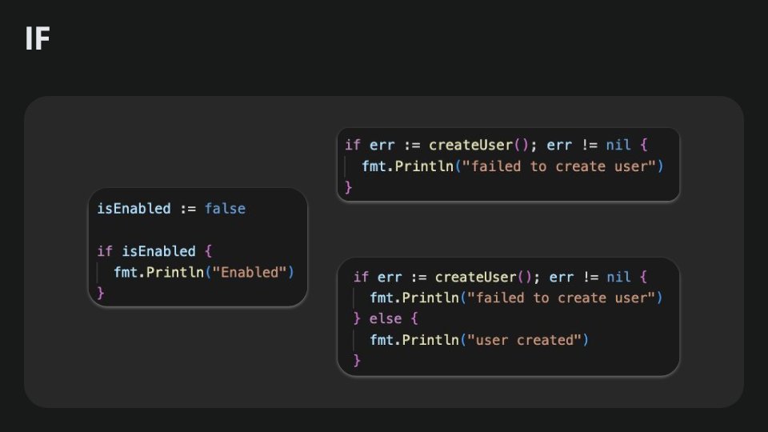
В Go конструкція `if` використовується для перевірки умов і виконання певного коду, якщо ці умови істинні. Синтаксис дуже простий і не вимагає дужок навколо умови:
```go
if умова {
    // Виконується, якщо умова істинна
} else if іншаУмова {
    // Виконується, якщо перша умова хибна, але іншаУмова істинна
} else {
    // Виконується, якщо усі попередні умови хибні
}
```
### Особливості if у `Go`
1. **Без дужок**: На відміну від більшості інших мов програмування, в Go передбачається, що ви не використовуєте круглих дужок (`()`) навколо умови. Тобто замість `if (condition) { ... }` пишемо просто `if condition { ... }`.
2. **Оператор присвоєння перед умовою**: У Go можна виконати коротке присвоєння всередині конструкції `if`. Наприклад, ви можете одразу ініціалізувати змінну для перевірки:
```go
if x := деякаФункція(); x < 0 {
    fmt.Println("x є від’ємним:", x)
} else if x == 0 {
    fmt.Println("x дорівнює 0")
} else {
    fmt.Println("x є додатним:", x)
}
```
3. **Без використання Boolean у вигляді числа**: В Go не можна писати `if 1` або `if 0`. Умови повинні повертати тип `bool`. Це дозволяє уникнути плутанини з використанням числових значень як істини/хибності.
4. **Жорстка типізація**: Якщо потрібно перевірити, чи змінна `bool` є істинною чи ні, її не можна неявно конвертувати до іншого типу. Наприклад, якщо ви хочете перевірити число, то слід явно порівняти його з іншим числовим значенням, замість того, щоб трактувати ненульове значення як істину.

### Прості умови
```go
    if a > b {
        fmt.Println("a більше за b")
    } else {
        fmt.Println("a не більше за b")
    }
```
### Умови з присвоєнням
```go
package main

import (
    "errors"
    "fmt"
)

// Функція, що повертає число та помилку
func mayFail(shouldFail bool) (int, error) {
    if shouldFail {
        return 0, errors.New("помилка виконання")
    }
    return 42, nil
}

func main() {
    // Якщо повертається помилка, одразу обробляємо її
    if result, err := mayFail(true); err != nil {
        fmt.Println("Сталася помилка:", err)
    } else {
        // Використовуємо result, якщо помилки не було
        fmt.Println("Результат:", result)
    }
}
```

### У сам If можна засунути ініціалізацію певного значеня
Відповідно у цьому значчені `err` тільки в області видимості данного блоку.
```go
if err := createUser(); err !=nil {
    fmt.Println("failed to create user")
}
```
Якщо хочемо потім десь використовувати цю помилку нам потрібно її спочатку задефайнити а вже потім в принципі писати увесь `if`

## SWITCH
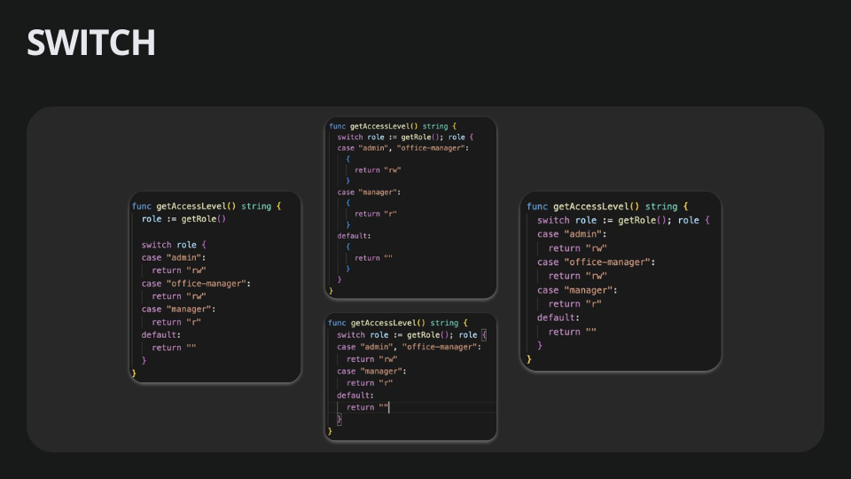
У GO `switch` Такий самий як і у всіх інших мовах, якщо говорити про python то це `match`, але у python трішки більш важкий і бвльш потужніший.
У GO `switch` якщо порівнювати з python то це просто цепочка щ `if elif`
### Як це працює
- Обчислюється **вираз**, що стоїть після `switch`.
- Порівнюється зі значеннями кожного `case` по черзі.
- Якщо знайдено збіг, виконується блок коду в цьому `case`, а потім **не виконується** код у інших `case`.
- Якщо жоден з `case` не співпав, виконується блок коду в `default` (якщо він є).

```go
func getAccessLevel() string {
	role := getRole()
	switch role {
	case "admin":
		return "rw"
	case "offrce-manager":
		return "rw"
	case "manager":
		return "r"
	default:
		return ""
	}
```
### 2. Кілька варіантів у одному case
Іноді зручно об’єднати кілька значень в одному блоці:

```go
func main() {
    day := "Saturday"

    switch day {
    case "Saturday", "Sunday":
        fmt.Println("Вихідний день")
    default:
        fmt.Println("Робочий день")
    }
}
```
### 3. Використання `switch` без виразу (switch true)
Можна писати умови прямо в `case`:
```go
func main() {
    x := 15

    switch {
    case x < 0:
        fmt.Println("x менше нуля")
    case x > 10:
        fmt.Println("x більше 10")
    default:
        fmt.Println("x від 0 до 10")
    }
}
```
### 4. Приклад із `fallthrough`
У Go за замовчуванням після виконання коду в одному `case` оператор `switch` завершує роботу. Але, якщо нам потрібно перейти до наступного `case`, вказуємо `fallthrough`:
```go
func main() {
    number := 2

    switch number {
    case 1:
        fmt.Println("Це число 1")
        fallthrough
    case 2:
        fmt.Println("Це число 2")
        fallthrough
    case 3:
        fmt.Println("Це число 3")
    default:
        fmt.Println("Інше число")
    }
}
```
- Якщо `number == 2`, виконається код у `case 2`: виведеться «Це число 2».
- Завдяки `fallthrough` виконання перейде далі до `case 3`: виведеться «Це число 3».
> **Note**: Обережно: використання `fallthrough` у Go зустрічається доволі рідко, бо часто легше написати логіку без «провалювання» у наступні `case`.

## FOR
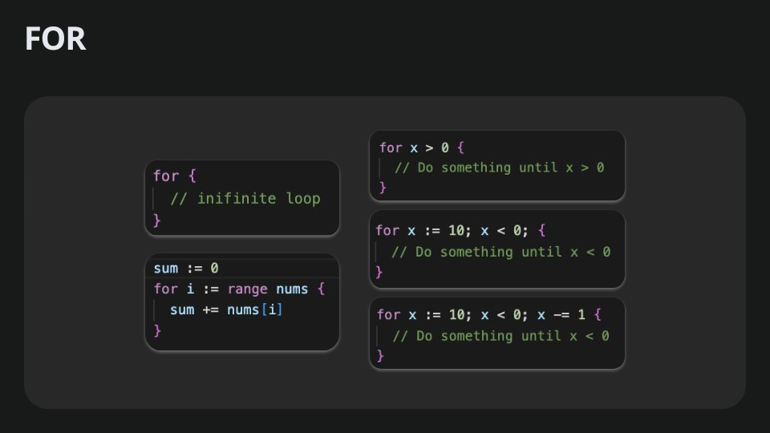

У `Golang` ключове слово `for` використовується для створення циклів. Це єдина конструкція для циклів у мові, яка може використовуватися для різних варіантів повторення.
### Синтаксис і варіанти використання `for`
#### 1. Класичний цикл з умовою
Цей варіант схожий на `for` у багатьох інших мовах програмування.

```go
for i := 0; i < 10; i++ {
    fmt.Println(i)
}
```
- `i := 0` – ініціалізація лічильника.
- `i < 10` – умова виконання циклу.
- `i++` – зміна лічильника.
- Цикл завершується, коли умова `i < 10` перестає бути істинною.

#### 2. Цикл тільки з умовою
Цей варіант схожий на `while` в інших мовах.

```go
i := 0
for i < 5 {
    fmt.Println(i)
    i++
}
```
- Умова `i < 5` перевіряється перед кожною ітерацією.
- Ітерація продовжується, доки умова істинна.

#### 3. Безумовний цикл
Це аналог нескінченного циклу `while(true)`.
```go
for {
    fmt.Println("Це нескінченний цикл")
    break // Для виходу з циклу
}
```
Безумовний цикл триває вічно, поки його не зупинити за допомогою `break`, `return` або інших механізмів.

#### 4. Цикл з використанням `range`

Цей варіант зручний для ітерації по масивах, зрізах, мапах, строках або каналах.

- Масив або зріз:
```go
numbers := []int{1, 2, 3, 4, 5}
for index, value := range numbers {
    fmt.Printf("Індекс: %d, Значення: %d\n", index, value)
}
```
- Мапа:
```go
m := map[string]int{"a": 1, "b": 2}
for key, value := range m {
    fmt.Printf("Ключ: %s, Значення: %d\n", key, value)
}
```
- Рядок:
```go
s := "Привіт"
for index, runeValue := range s {
    fmt.Printf("Індекс: %d, Руна: %c\n", index, runeValue)
}
```
- Якщо індекс або значення не потрібні, їх можна пропустити, використовуючи `_`:
```go
for _, value := range numbers {
    fmt.Println(value)
}
```
#### 5. Оператори `break` і `continue`
- `break` зупиняє виконання циклу.
- `continue` пропускає поточну ітерацію і переходить до наступної.
```go
for i := 0; i < 10; i++ {
    if i == 5 {
        break // Зупиняє цикл
    }
    if i%2 == 0 {
        continue // Пропускає парні числа
    }
    fmt.Println(i)
}
```

### Ітератори
Реліз версії Go 1.23 додав підтримку ітераторів і пакет `iter`. Тепер можна перебирати константи, контейнери (`map`, `slice`, `array`, `string`) і функції

**Ітератор** — це поведінковий патерн, що дозволяє послідовно обходити складну колекцію, не розкриваючи деталі її реалізації. 
-
Завдяки Ітераторові, клієнт може обходити різні колекції в один і той же спосіб, використовуючи єдиний інтерфейс ітераторів

Суть патерна Ітератор — вивести логіку послідовного проходження колекції в окремий об’єкт під назвою «ітератор». Цей ітератор надає універсальні методи для послідовного проходження колекції незалежно від її типу.

```go
import "iter"

type Item int

func Items() iter.Seq[Item] {
	return func(yield func(Item) bool) {
		items := []Item{1, 2, 3}
		for _, v := range items {
			if !yield(v) {
				return
			}
		}
	}

}
```
Тепер у `Go` в принципі до любого типа ми можемо прикріпити ітератор. Загалом хоч воно і називається ітератор але по факту це генератори. Які генерують ф-ції як у `Python`.


## Defer
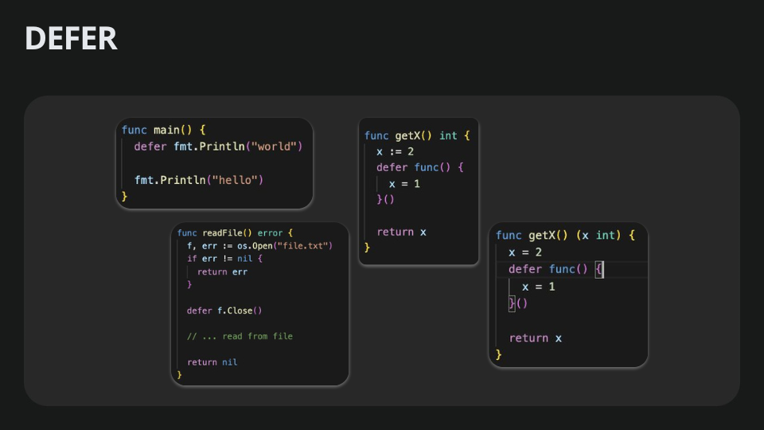
Defer — команда для відкладеного виконання дії перед завершенням основної функції.
-
Найцікавіше, шо вигідно виділяє GO від інших мов.

#### Популярний приклад, це закриття файлу або закриття з’єднання до БД:
Не залежно від того як виконається наш код. Робота з файлом у цьому прикладі закриється по завершенню роботи функції.   
```go
func FileOperationsExample() error {
	f, err := os.Create("/tmp/defer.txt")
	if err != nil {
		return err
	}
	defer f.Close()

	// запис у файл або інші операції

	return nil
}
```

**Defer** також може міняти іменовані return значення
```go
func getX() (x int) {
	x = 2
	defer func() {
		x = 1
	}()
	return x // x = 1
}
```

## Пакети
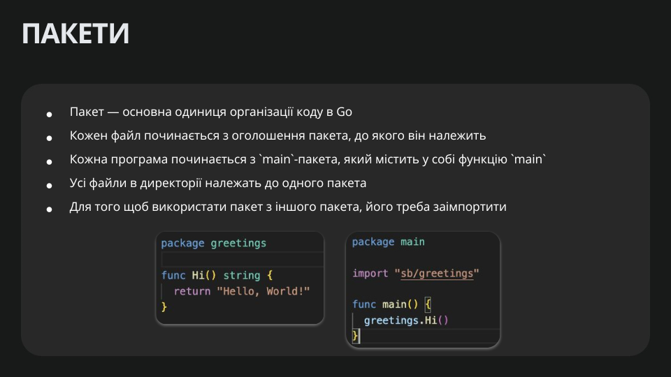
- Пакети у `GO`. Це така "цеглинка" з котрої будується Goшна програма.
- Мінімальний модуль який можна Експортити імпортити. 
- В рамках 1ного пакета немає ніяких модифікаторів доступу. Не можна в рамках 1ного пакета зробити якусь зміну публічно чи приватною для тих же самих функцій які обьявлені в цьому пакеті
- Але можна прописати модифікатор доступа регістром першої літери назви. І таким чином саказати що доступна сутність, тип, функція чи константа чи змінна ззовні пакету
- Усі файли в папці належать до 1го пакету.
- У кожного файлу зверху ми завжди обьяввляємо назву цього пакету 
- При імпортах можна використовувати аліаси
- Немає відностних імпортів. Є лише абсолютні шляхи, де рутовим є назва вашого модуля

```go
package main
```
- Щоб використати пакет або якусь річ із пакету нам потрібно її імпортувати її шлях, не назву а саме щлях до неї
```go
import (
    "github.com/joho/godotenv"
    mqtt "github.com/eclipse/paho.mqtt.golang"
    "github.com/SpasiboVadya/ecohome/mqttConnector/internal/entities"
)
```
## Модулі
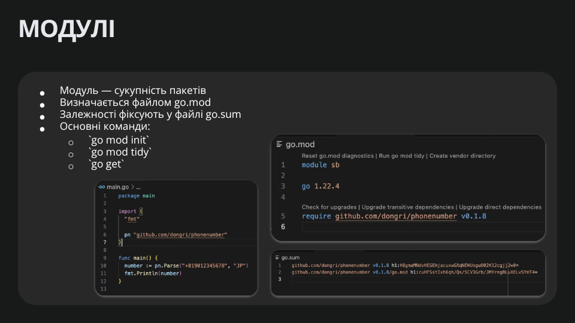
- Модуль - це просто сукупність пакетів які можна запаблішити, десь викуористовувати. 
- Це може бути як бібліотека так і програма
- Визначається модуль файликом `go.mod`
- Go mod подібний до `pyproject.toml` у **python** або `package.json` у **node.js**
- Цей файл може містити вашу версію та список бібліотек, які ви імпортуєте, 
- В той час як `go.sum` використовується для зберігання актуальної версії та всіх залежностей (подібно до `poertry.lock`)

- `go mod init` - ініціалізує модуль у існуючії директорії. Потрібно передати назву модуля
```cmd
go mod init mymodule
```

- `go mod tidy` - Вона встановлює пакети які використовуються у го але не задефайнені. І видаляє пакети які не використовуються в нашій програмі.
```cmd
go mod tidy
```