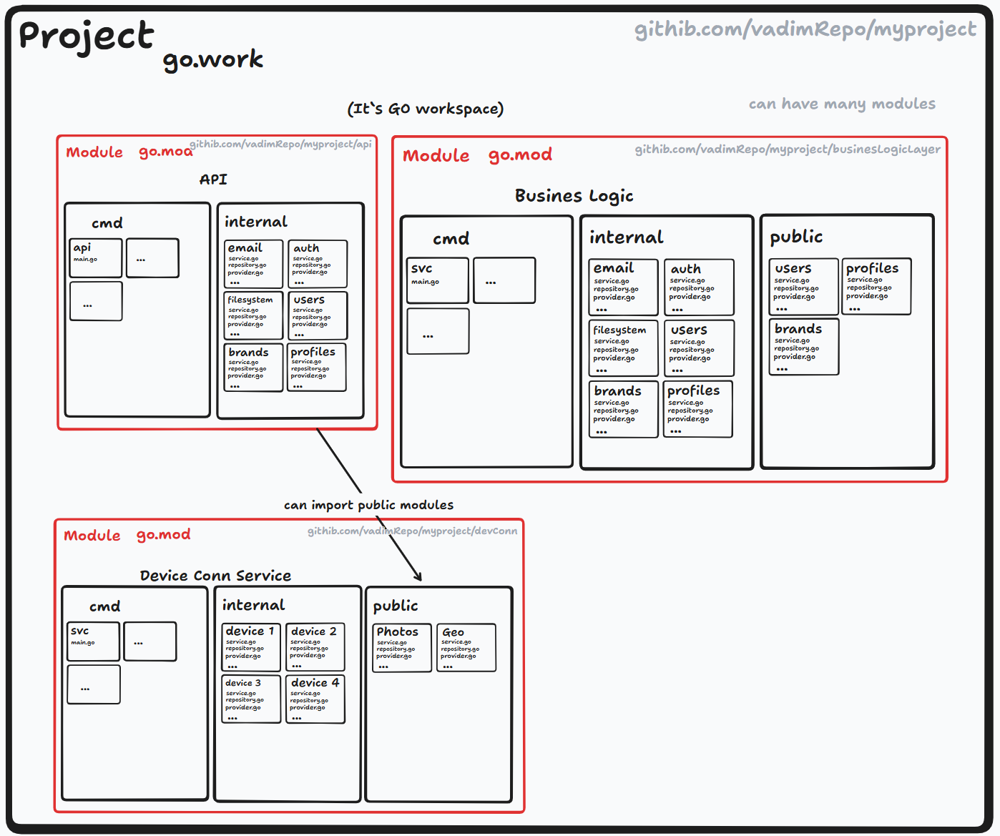
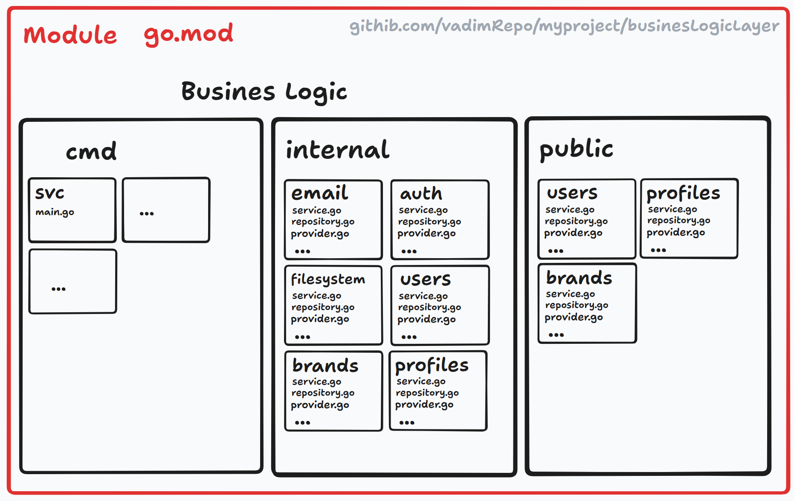
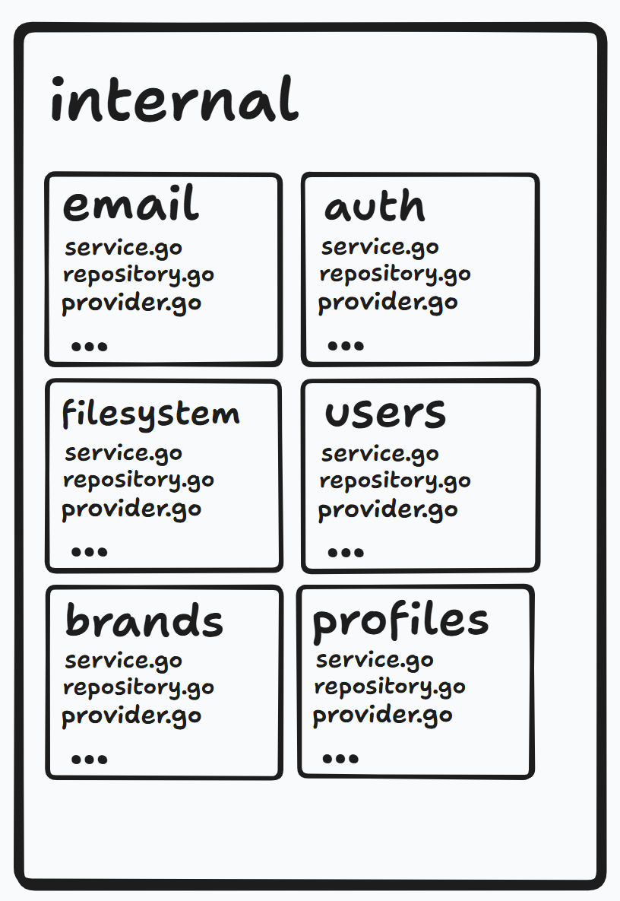
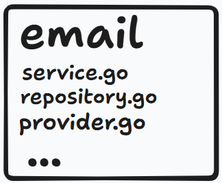

# Workspace

Робочий простір як початок проекту
-

**Робочий простір (workspace)** — це базовий етап у розробці проекту на Go, який дозволяє організувати код, залежності та логіку проекту. У контексті Go, робочий простір може включати декілька модулів, які спрощують розробку і тестування великих проєктів, де частини розробляються окремо.

Go пропонує систему модулів (`go.mod`), але для більш складних проєктів, які потребують роботи з декількома модулями одночасно, використовується файл `go.work`.



Як почати проект із робочим простором?
-

1. **Створіть базову директорію проекту**:

```bash
mkdir my-go-project
cd my-go-project
```

2. **Ініціалізуйте модуль Go**:

```bash
go mod init github.com/username/my-go-project
```

3. **Якщо проект містить кілька модулів, створіть додаткові директорії для них**:

```bash
mkdir module1 module2
cd module1
go mod init github.com/username/module1
cd ../module2
go mod init github.com/username/module2
```

4. Ініціалізуйте робочий простір go.work для керування всіма модулями: Поверніться до кореневої директорії проекту та виконайте:

```bash
go work init ./module1 ./module2
```

5. **Перевірте файл `go.work`, який створився: Він буде виглядати так:**

```go
go 1.18

use (
    ./module1
    ./module2
)
```

Структура проекту з go.work
-

```bash
my-go-project/
│
├── go.work
├── module1/
│   ├── go.mod
│   └── main.go
│
├── module2/
│   ├── go.mod
│   └── main.go
```

- `go.work` — робочий простір, що об’єднує модулі `module1` і `module2`.
- `module1/go.mod` та `module2/go.mod` — окремі файли модулів для кожного компонента.

Як працювати з go.work?
-

1. Додавання нового модуля до існуючого go.work: Якщо ви додаєте новий модуль до проекту, просто виконайте:

```bash
go work use ./module3
```

2. Перевірка доступних модулів: Ви можете переглянути, які модулі входять до робочого простору:

```bash
go work edit
```

3. Запуск проекту: Go автоматично враховує всі модулі з робочого простору при виконанні команд, таких як:

```bash

go build
go test
```

# Модулі



**Модулі** — це ключовий елемент системи керування залежностями в Go, представлений у версії Go 1.11. Вони дозволяють визначати залежності проекту та забезпечують ізольованість версій. Файл `go.mod` є основним механізмом для оголошення модулів і їх залежностей.

**Модуль** — це набір пакетів Go, які знаходяться в одній директорії і керуються одним файлом go.mod. Модуль включає як ваш власний код, так і залежності, необхідні для його роботи.

`go.mod` — це файл у кореневій директорії модуля, який
-

- Вказує ім'я модуля (його унікальний шлях, зазвичай це URL репозиторію).
- Описує залежності проекту та їх версії.
- Зберігає інформацію про мінімальну версію Go, яка потрібна для цього проекту
- Це може бути як бібліотека так і програма
- `Go mod` подібний до `pyproject.toml` у **python** або `package.json` у **node.js**
- В той час як `go.sum` використовується для зберігання актуальної версії та всіх залежностей (подібно до `poertry.lock`)

`go work use`
---

Команда `go work use` використовується для додавання нового модуля до робочого простору, який керується файлом `go.work`. Вона дозволяє включити модуль у робочий простір, щоб використовувати його локальні зміни без необхідності публікації в репозиторій або імпортування через віддалене джерело.

Приклад `go.mod`
-

- `go mod init` - ініціалізує модуль у існуючії директорії. Потрібно передати назву модуля

```bash
go mod init github.com/username/myproject
```

- Це створить файл go.mod із вмістом

```go
module github.com/username/myproject

go 1.20
```

- `module` — ім'я модуля. Зазвичай це шлях до репозиторію (наприклад, github.com/username/myproject).
- `go` — мінімальна версія Go, яка потрібна для роботи з проектом.

`go mod tidy`
---

`go mod tidy` - Вона встановлює пакети які використовуються у го але не задефайнені. І видаляє пакети які не використовуються в нашій програмі.

```bash
go mod tidy
```

- У файл go.mod буде додано залежність:

```go
require github.com/sirupsen/logrus v1.8.1
```

**Керуйте залежностями**: Використовуйте команду `go get` для додавання, оновлення або видалення залежностей:

```bash
go get github.com/sirupsen/logrus@v1.9.0
```

Що таке `go.sum`?
-

Поряд із файлом 'go.mod' автоматично створюється файл 'go.sum'. Він містить контрольні суми всіх залежностей вашого проекту, щоб гарантувати їхню цілісність і уникати атак через компрометацію залежностей.

```
github.com/sirupsen/logrus v1.8.1 h1:V3m...
github.com/sirupsen/logrus v1.8.1/go.mod h1:Ljf...
```

`go.sum` потрібен для надійного відтворення середовища при спільній розробці.

# Пакети


У Go пакети `packages` є основною одиницею організації коду. Вони дозволяють розробникам розбивати програму на логічні модулі, сприяючи повторному використанню коду, підтримці і ясності.

Що таке пакет?
---

**Пакет** — це набір файлів Go, які знаходяться в одній директорії. Всі файли в цій директорії належать до одного пакету і визначають його ім'я за допомогою директиви package на початку файлу.


Приклад:

```go
package mypackage
```

Типи пакетів
---

1. **Вбудовані пакети (Standard Library)**: Go має багату стандартну бібліотеку, яка включає пакети для роботи з:

- Форматуванням (fmt)
- Вхідними та вихідними даними (io, os)
- Роботою з HTTP (net/http)
- Синхронізацією (sync) та багато іншого.

2. **Користувацькі пакети (User-defined Packages)**: Ви можете створювати свої пакети, щоб організувати код у проекті.

Наприклад:

```go
myproject/
├── main.go
├── math/
│   ├── math.go
│   └── math_test.go
```

3. **Зовнішні пакети**: Це сторонні бібліотеки, які можна додати у ваш проект за допомогою `go get`.

Імпортування пакетів
---

Go дозволяє імпортувати пакети за допомогою директиви `import`.

**Одиничний імпорт:**

```go
import "fmt"
```

**Груповий імпорт:**

```go
import (
    "fmt"
    "os"
)
```

**Імпорт із псевдонімом:**

```go
import m "myproject/math"

func main() {
    result := m.Add(2, 3)
    fmt.Println("Результат:", result)
}
```

Правила для пакетів
---

1. **Ім'я пакета**: Ім'я пакету вказується директивою `package` і повинно бути однаковим у всіх файлах в одній директорії.

```go
package utils
```

2. **Публічні та приватні імена:**

- Імена, які починаються з великої літери, є **експортованими** (доступні поза пакетом).
- Імена з малої літери є **неекспортованими** (доступні лише всередині пакета).

```go
package math

// Exported
func Add(a int, b int) int {
    return a + b
}

// Unexported
func subtract(a int, b int) int {
    return a - b
}
```

3. **Один головний файл `main`**: Програма Go починається з виконання функції `main`, яка знаходиться в пакеті `main`.

```go
package main

func main() {
    fmt.Println("Hello, World!")
}
```
