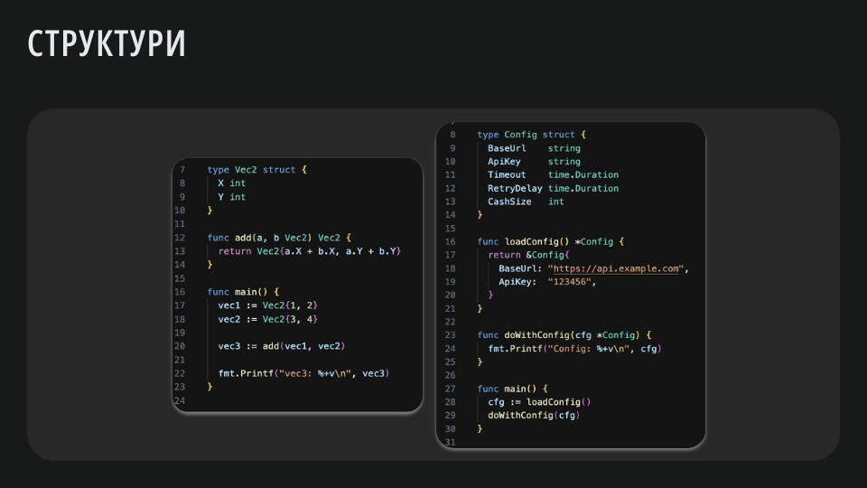
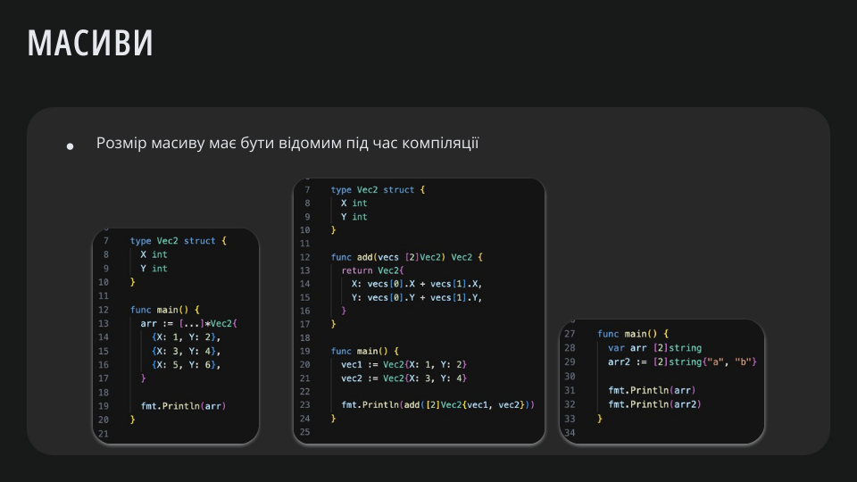
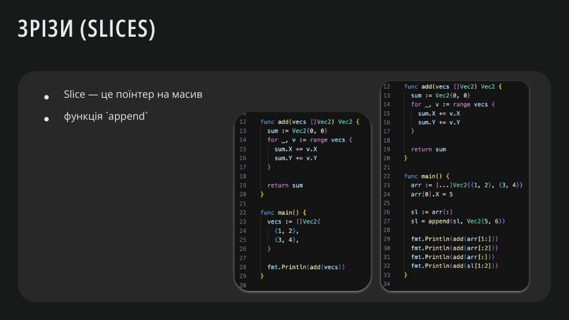
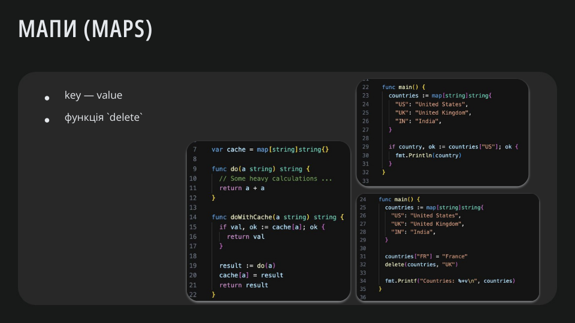
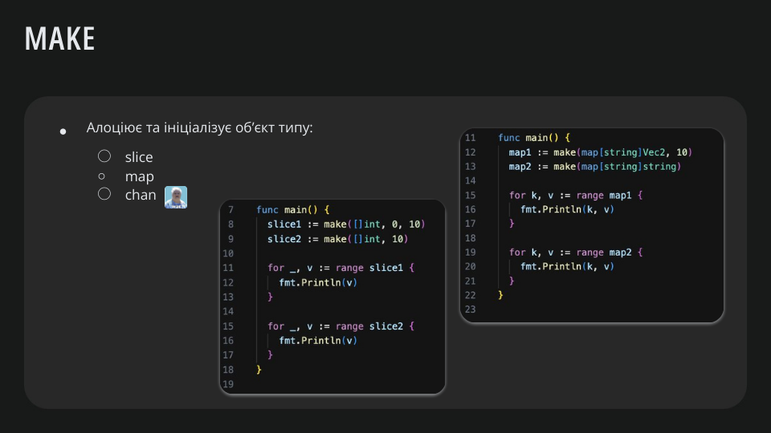
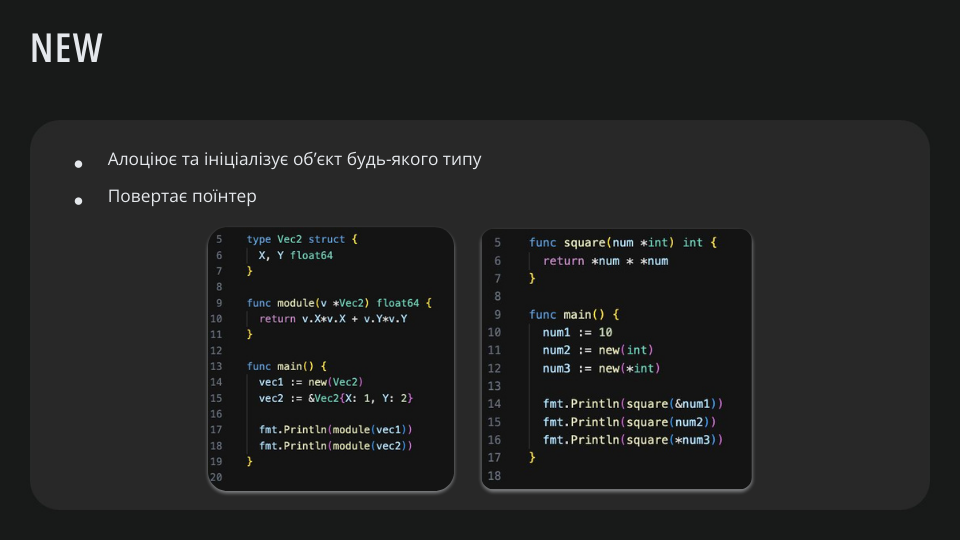
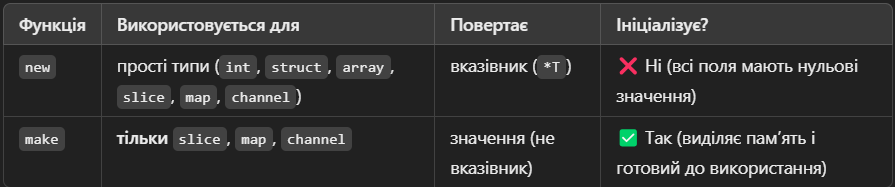

# Lesson 3: `Complex composed data types`

У Go, як і в багатьох мовах програмування, комплікейтед компоновані типи даних `complex composed data types` — це типи, які створюються шляхом комбінування базових типів (наприклад, `int`, `string`) або інших складених типів (як-от `структури` чи `масиви`) для створення складніших структур даних. Ці типи використовуються для представлення складних об'єктів і структур, що відповідають логіці програми.

**Компоновані типи** — це ті, що складаються з кількох полів, які можуть бути різних типів

## Структури `struct`



Структура `struct` — це спеціальний тип даних, який дозволяє згрупувати кілька полів (з можливістю різних типів) в єдиний логічний об'єкт. Це схоже на класи в інших мовах програмування, хоча Go не підтримує класичне об'єктно-орієнтоване програмування (наприклад, наслідування).

### Оголошення структури

Структури оголошуються за допомогою ключового слова type і визначаються через struct.

```go
type Person struct {
    FirstName string
    LastName  string
    Age       int
    IsMarried bool
}
```

- `Person` — це ім'я структури.
- Поля структури мають такі типи: `string`, `int`, `bool`.

### Ініціалізація структури

1. Через літерал структури:

```go

person := Person{
    FirstName: "John",
    LastName:  "Doe",
    Age:       30,
    IsMarried: false,
}
```

2. Без вказівки імен полів (позиційний порядок):

```go
person := Person{"Jane", "Smith", 25, true}
```

> **Note**:  Цей підхід менш надійний, оскільки зміна порядку полів у структурі може зламати код.

3. Ініціалізація порожньої структури:

```go
var person Person
person.FirstName = "Alice"
person.Age = 28
```

### Доступ до полів

До полів структури можна звертатися за допомогою крапкової нотації.

```go
fmt.Println(person.FirstName) // Виведе: John
fmt.Println(person.Age)       // Виведе: 30
```

### Вкладені структури

Go підтримує вкладені структури, дозволяючи створювати ієрархічні типи даних.

```go
type Address struct {
    City    string
    ZipCode int
}

type Employee struct {
    Name    string
    Age     int
    Address Address
}
```

Приклад використання:

```go
employee := Employee{
    Name: "Jack",
    Age:  40,
    Address: Address{
        City:    "New York",
        ZipCode: 10001,
    },
}

fmt.Println(employee.Address.City) // Виведе: New York
```

### Анонімні (вбудовані) структури

У Go можна визначати анонімні структури безпосередньо в коді.

```go
car := struct {
    Brand string
    Year  int
}{
    Brand: "Toyota",
    Year:  2022,
}

fmt.Println(car.Brand) // Виведе: Toyota
```

### Покажчики на структури

Структури можуть бути використані з покажчиками, що дозволяє уникати копіювання даних.

```go
person := &Person{
    FirstName: "John",
    LastName:  "Doe",
    Age:       30,
}

// Зміна поля через покажчик
person.Age = 35
fmt.Println(person.Age) // Виведе: 35
```

Go автоматично розіменовує покажчики на структури, тому доступ до полів не вимагає додаткового синтаксису (`(*person).Age`).

### Методи для структур

У Go методи можна визначати для структур. Методи дозволяють виконувати операції над структурою.

```go
type Rectangle struct {
    Width  float64
    Height float64
}

// Метод для обчислення площі
func (r Rectangle) Area() float64 {
    return r.Width * r.Height
}


// Метод для зміни розмірів (з використанням покажчика)
func (r *Rectangle) Resize(newWidth, newHeight float64) {
    r.Width = newWidth
    r.Height = newHeight
}
```

Використання:

```go
rect := Rectangle{Width: 10, Height: 5}
fmt.Println(rect.Area()) // Виведе: 50

rect.Resize(20, 10)
fmt.Println(rect.Area()) // Виведе: 200
```

### Теги полів у структурі

Go дозволяє додавати теги до полів структур для метаінформації. Теги часто використовуються для серіалізації (наприклад, JSON, XML).

```go
type User struct {
    ID    int    `json:"id"`
    Name  string `json:"name"`
    Email string `json:"email"`
}
```

При серіалізації структура буде перетворена у такий JSON:

```json
{
    "id": 1,
    "name": "John Doe",
    "email": "john.doe@example.com"
}
```

Код для серіалізації:

```go
import (
    "encoding/json"
    "fmt"
)

func main() {
    user := User{ID: 1, Name: "John Doe", Email: "john.doe@example.com"}
    jsonData, _ := json.Marshal(user)
    fmt.Println(string(jsonData))
}
```

### Порівняння структур

У Go структури можна порівнювати, якщо всі їхні поля можна порівняти (наприклад, не містять слайсів чи мап).

```go
type Point struct {
    X, Y int
}

p1 := Point{X: 1, Y: 2}
p2 := Point{X: 1, Y: 2}

fmt.Println(p1 == p2) // Виведе: true
```

### Копіювання структур

При присвоєнні однієї структури іншій створюється **копія**, а не посилання.

```go
p1 := Point{X: 1, Y: 2}
p2 := p1
p2.X = 10

fmt.Println(p1.X) // Виведе: 1
fmt.Println(p2.X) // Виведе: 10
```

## Масиви `array`



**Масив** — це структура даних, яка зберігає фіксовану кількість елементів одного типу. На відміну від інших мов програмування (наприклад, Python), розмір масиву в Go є частиною його типу, і він не може змінюватися після створення.

### Оголошення масиву

Для оголошення масиву використовується синтаксис:

```go
var numbers [5]int // Масив з 5 елементів типу int
```

### Ініціалізація масиву

1. **За замовчуванням**: Елементи масиву отримують **нульові значення** (zero value) для свого типу.

```go
var numbers [5]int
fmt.Println(numbers) // Виведе: [0 0 0 0 0]
```

2. **Під час оголошення:**

```go
numbers := [5]int{1, 2, 3, 4, 5}
fmt.Println(numbers) // Виведе: [1 2 3 4 5]
```

3. **Без зазначення розміру:** Go дозволяє автоматично визначити розмір масиву, якщо ви задаєте значення елементів під час ініціалізації:

```go
numbers := [...]int{10, 20, 30}
fmt.Println(numbers) // Виведе: [10 20 30]
```

### Доступ до елементів

Доступ до елементів масиву здійснюється за допомогою індексу (починаючи з 0).

```go
var numbers [3]int
numbers[0] = 42
numbers[1] = 27

fmt.Println(numbers[0]) // Виведе: 42
fmt.Println(numbers[1]) // Виведе: 27
fmt.Println(numbers[2]) // Виведе: 0 (нульове значення)
```

### Ітерація по масиву

Для перебору масиву використовується цикл `for`.

**Ітерація за індексами**:

```go
numbers := [5]int{10, 20, 30, 40, 50}
for i := 0; i < len(numbers); i++ {
    fmt.Println(numbers[i])
}
```

**Ітерація за допомогою** `range`:

```go
for index, value := range numbers {
    fmt.Printf("Index: %d, Value: %d\n", index, value)
}
```

### Властивості масивів

1. **Фіксований розмір**: Розмір масиву є частиною його типу. Це означає, що масиви різного розміру — це різні типи.

```go
var a [3]int
var b [5]int
// a = b // Помилка компіляції: різні типи
```

2. **Копіювання**: Коли масив передається в функцію або присвоюється іншій змінній, створюється копія масиву, а не посилання.

```go
original := [3]int{1, 2, 3}
copy := original
copy[0] = 100

fmt.Println(original) // Виведе: [1 2 3]
fmt.Println(copy)     // Виведе: [100 2 3]
```

3. **Довжина масиву**: Довжину масиву можна отримати за допомогою функції `len`.

```go
numbers := [5]int{1, 2, 3, 4, 5}
fmt.Println(len(numbers)) // Виведе: 5
```

### Масиви та функції

Масиви можна передавати у функції як аргументи. Оскільки масив копіюється, зміни в функції не вплинуть на оригінальний масив.

```go
func modifyArray(arr [3]int) {
    arr[0] = 100
}

func main() {
    numbers := [3]int{1, 2, 3}
    modifyArray(numbers)
    fmt.Println(numbers) // Виведе: [1 2 3]
}
```

Щоб працювати з оригінальним масивом, потрібно передати його вказівник:

```go
func modifyArray(arr *[3]int) {
    arr[0] = 100
}

func main() {
    numbers := [3]int{1, 2, 3}
    modifyArray(&numbers)
    fmt.Println(numbers) // Виведе: [100 2 3]
}
```

### Операції над масивами

1. Порівняння масивів: Масиви можна порівнювати, якщо їхні елементи мають порівнюваний тип.

```go
a := [3]int{1, 2, 3}
b := [3]int{1, 2, 3}
c := [3]int{4, 5, 6}

fmt.Println(a == b) // Виведе: true
fmt.Println(a == c) // Виведе: false
```

2. **Копіювання**: Масиви можна копіювати просто через оператор присвоєння:

```go
a := [3]int{1, 2, 3}
b := a
b[0] = 100

fmt.Println(a) // Виведе: [1 2 3]
fmt.Println(b) // Виведе: [100 2 3]
```

### Обмеження масивів у Go

Через фіксований розмір масивів у Go частіше використовуються **слайси** — більш гнучка альтернатива масивам, яка дозволяє змінювати розмір під час виконання програми.

**Різниця між масивами та слайсами:**

- **Масив**: Фіксований розмір, є частиною типу.
- **Слайс**: Динамічний розмір, є більш гнучким у використанні.

## Слайси  `slice`


Слайс (`slice`) в Go — це гнучка структура даних, яка є надбудовою над масивом і дозволяє працювати зі змінною кількістю елементів. На відміну від масивів, розмір слайсу може змінюватися динамічно під час виконання програми.

### Основні характеристики слайсів

1. **Динамічний розмір:** Ви можете додавати або видаляти елементи зі слайсу.
2. **Посилання на масив:** Слайс є "вікном" до базового масиву, тобто він не копіює дані, а посилається на існуючий масив.
3. **Довжина та ємність:**
    - **Довжина (`len`):** Кількість елементів у слайсі.
    - **Ємність (`cap`):** Максимальна кількість елементів, які слайс може вмістити без алокації нового масиву.

### Оголошення та ініціалізація слайсів

1. **Оголошення порожнього слайсу**

```go
var s []int
fmt.Println(s)        // Виведе: []
fmt.Println(len(s))   // Виведе: 0
fmt.Println(cap(s))   // Виведе: 0
```

2. **Ініціалізація слайсу за допомогою літерала**

```go
s := []int{1, 2, 3, 4, 5}
fmt.Println(s)        // Виведе: [1 2 3 4 5]
fmt.Println(len(s))   // Виведе: 5
fmt.Println(cap(s))   // Виведе: 5
```

3. **Створення слайсу за допомогою `make`**

- Функція `make` дозволяє створити слайс з певною довжиною та ємністю.

```go
s := make([]int, 5) // Довжина 5, ємність 5
fmt.Println(s)      // Виведе: [0 0 0 0 0]

s2 := make([]int, 3, 5) // Довжина 3, ємність 5
fmt.Println(s2)         // Виведе: [0 0 0]
```

### Доступ до елементів слайсу

Як і з масивами, доступ до елементів слайсу здійснюється через індекси.

```go
s := []int{10, 20, 30}
fmt.Println(s[0]) // Виведе: 10

s[1] = 25         // Зміна значення
fmt.Println(s)    // Виведе: [10 25 30]
```

### Ітерація по слайсу

З використанням циклу `for`:

```go
s := []int{10, 20, 30}
for i := 0; i < len(s); i++ {
    fmt.Println(s[i])
}
```

З використанням `range`:

```go
for index, value := range s {
    fmt.Printf("Index: %d, Value: %d\n", index, value)
}
```

### Операції над слайсами

1. **Обрізка слайсу (`slicing`)**
Слайс дозволяє створювати підслайси з існуючого.

```go
s := []int{1, 2, 3, 4, 5}
subSlice := s[1:4] // Від індексу 1 до 4 (4 не включається)
fmt.Println(subSlice) // Виведе: [2 3 4]
```

- Ви можете пропустити початковий або кінцевий індекс:

```go
fmt.Println(s[:3]) // [1 2 3]
fmt.Println(s[2:]) // [3 4 5]
```

2. **Додавання елементів** (`append`)
Функція `append` дозволяє додавати елементи до слайсу. Якщо ємність слайсу недостатня, створюється новий масив.

```go
s := []int{1, 2, 3}
s = append(s, 4, 5)
fmt.Println(s) // Виведе: [1 2 3 4 5]
```

3. Копіювання слайсів (copy)
Функція copy дозволяє копіювати елементи одного слайсу в інший.

```go
source := []int{1, 2, 3}
destination := make([]int, len(source))
copy(destination, source)

fmt.Println(destination) // Виведе: [1 2 3]
```

### Довжина (`len`) і ємність (`cap`)

Слайси мають довжину (len) та ємність (cap).

```go
s := make([]int, 3, 5) // Довжина 3, ємність 5
fmt.Println(len(s))    // Виведе: 3
fmt.Println(cap(s))    // Виведе: 5
```

Якщо додати елемент за межі ємності, Go автоматично створить новий масив із більшою ємністю.

```go
s = append(s, 1, 2, 3)
fmt.Println(len(s)) // Виведе: 6
fmt.Println(cap(s)) // Ємність буде збільшена, наприклад, до 10
```

### Слайси — це посилання

Слайс працює як посилання на базовий масив. Зміни в слайсі впливають на оригінальний масив.

```go
array := [5]int{1, 2, 3, 4, 5}
s := array[1:4] // Слайс з елементів [2, 3, 4]

s[0] = 100
fmt.Println(array) // Виведе: [1 100 3 4 5]
```

### Особливості та рекомендації

1. **Робота з пам’яттю**: Якщо ви створюєте підслайс із великого слайсу, оригінальний масив залишиться в пам’яті. Якщо вам не потрібні старі дані, створіть новий слайс із копією елементів.

```go
largeSlice := make([]int, 10000)
subSlice := largeSlice[:10]
newSlice := append([]int{}, subSlice...) // Створення копії
```

2. **Динамічний розмір:** Для даних із динамічною кількістю елементів завжди використовуйте слайси замість масивів.

3. **`nil` слайси:** Порожній слайс має значення `nil`, але його довжина (`len`) дорівнює 0.

```go
var s []int
fmt.Println(s == nil) // Виведе: true
```

## Мапи  `maps`


Мапа (`map`) — це структура даних, яка дозволяє зберігати пари ключ-значення. Ключі в мапі унікальні, а значення можна отримати, додати чи змінити за допомогою ключа.

### Основні характеристики мап

1. **Ключі повинні бути порівнюваними типами:** Наприклад, `string`, `int`, `float`, але не слайси або мапи.
2. **Значення можуть бути будь-якого типу**.
3. **Немає гарантованого порядку**: Мапи не зберігають порядок вставки елементів.

### Оголошення та ініціалізація мап

1. Оголошення пустої мапи

```go
var myMap map[string]int // Пустий map, поки не ініціалізований
```

> **Примітка**: З такою мапою не можна працювати, поки вона не буде ініціалізована через make або літерал.

2. Створення мапи за допомогою make

```go
myMap := make(map[string]int)
```

3. Ініціалізація мапи з літералом

```go
myMap := map[string]int{
    "apple":  5,
    "banana": 3,
    "orange": 7,
}
```

### Основні операції з мапами

1. **Додавання та оновлення значень**

```go
myMap := make(map[string]int)
myMap["apple"] = 5      // Додавання пари ключ-значення
myMap["banana"] = 3
myMap["apple"] = 10     // Оновлення значення ключа "apple"

fmt.Println(myMap)      // Виведе: map[apple:10 banana:3]
```

2. **Читання значень**

```go
value := myMap["apple"]
fmt.Println(value)      // Виведе: 10
```

3. **Перевірка наявності ключа**

```go
value, exists := myMap["orange"]
if exists {
    fmt.Println("Ключ знайдено:", value)
} else {
    fmt.Println("Ключ не знайдено")
}
```

4. **Видалення значень**

```go
delete(myMap, "apple")
fmt.Println(myMap)      // Виведе: map[banana:3]
```

### Приклад використання мапи

```go
package main

import "fmt"

func main() {
    // Створення мапи
    inventory := map[string]int{
        "apples":  10,
        "bananas": 20,
    }

    // Додавання елементів
    inventory["oranges"] = 15

    // Читання елементів
    fmt.Println("Апельсини:", inventory["oranges"])

    // Перевірка наявності ключа
    value, exists := inventory["grapes"]
    if exists {
        fmt.Println("Виноград у наявності:", value)
    } else {
        fmt.Println("Винограду немає")
    }

    // Видалення елемента
    delete(inventory, "apples")

    // Ітерація по мапі
    for fruit, count := range inventory {
        fmt.Printf("%s: %d\n", fruit, count)
    }
}
```

### Особливості

1. **Мапи порожні за замовчуванням**
Мапа має значення `nil`, якщо її не ініціалізувати:

```go
var myMap map[string]int
fmt.Println(myMap == nil) // Виведе: true
```

Працювати з такою мапою не можна, поки вона не буде ініціалізована через make.

2. **Мапи як посилання**
Мапа є посиланням на дані, тому зміни, зроблені в одній змінній мапи, впливають на інші:

```go
original := map[string]int{"apple": 5}
copyMap := original
copyMap["apple"] = 10

fmt.Println(original) // Виведе: map[apple:10]
```

3. **Мапи не гарантують порядок**
Ключі в мапі зберігаються в довільному порядку, навіть якщо ви додавали їх у певному порядку.

### **Практичний приклад**: підрахунок слів у рядку

```go
package main

import (
    "fmt"
    "strings"
)

func main() {
    text := "apple banana apple orange apple banana"
    words := strings.Fields(text)

    wordCount := make(map[string]int)
    for _, word := range words {
        wordCount[word]++
    }

    fmt.Println("Підрахунок слів:")
    for word, count := range wordCount {
        fmt.Printf("%s: %d\n", word, count)
    }
}
```

Результат:

```makefile
Підрахунок слів:
banana: 2
orange: 1
apple: 3
```

## Операція  `make`


Операція `make` використовується для створення та ініціалізації деяких вбудованих типів даних: **слайсів (`slices`)**, **мап (`maps`)** та **каналів (`channels`)**. Вона дозволяє створювати ці структури в пам'яті з попередньо заданими характеристиками, такими як довжина, ємність або буферизованість.

```go
make(T, args)
```

- `T` – тип, який створюється (`slice`, `map`, `channel`).
- `args` – параметри, що залежать від типу (`len`, `cap`, буфер для каналів).

**Створення слайсу**
---

```go
s := make([]int, 5, 10)
fmt.Println(len(s), cap(s)) // 5 10
```

- `make([]int, 5, 10)` створює слайс довжиною `5` і ємністю `10`.
- Якщо `cap` не вказано, ємність буде рівна довжині.

**Еквівалент без `make`:**

```go
s := []int{0, 0, 0, 0, 0}
```

**Створення мапи**
---

```go
m := make(map[string]int)
m["age"] = 30
fmt.Println(m) // map[age:30]
```

- `make(map[string]int)` створює пусту мапу, яку можна заповнювати значеннями.

**Еквівалент без make:**

```go
m := map[string]int{}
```

**Створення каналу**
---

```go
ch := make(chan int, 2)
ch <- 1
ch <- 2
fmt.Println(<-ch) // 1
```

- `make(chan int, 2)` створює буферизований канал з розміром 2.

**Еквівалент без `make` неможливий, бо канали треба створювати через `make`.**

## Операція  `New`



`new` - використовується для **виділення пам’яті** та створення **вказівника** на нульове значення певного типу. Це менш гнучкий підхід, ніж `make`, оскільки `new` не ініціалізує складні типи (наприклад, `map` або `slice`), а просто виділяє пам’ять і повертає вказівник.

```go
ptr := new(T)
```

- `T` – будь-який тип (`int`, `struct`, `array`, тощо).
- `ptr` – повертається **вказівник** на виділену пам’ять.

 Приклади використання

**Виділення пам’яті для простих типів**
---

```go
num := new(int)
fmt.Println(*num) // 0 (за замовчуванням)
*num = 10
fmt.Println(*num) // 10
```

- `new(int)` створює вказівник на `int`, ініціалізований `0`.

**Це еквівалентно:**

```go
var num int  // оголошення змінної
numPtr := &num // отримання вказівника
```

**Виділення пам’яті для `struct`**
---

```go
type User struct {
    Name string
    Age  int
}

u := new(User)
fmt.Println(u.Name, u.Age) // "" 0
u.Name = "John"
fmt.Println(u.Name) // John
```

- `new(User)` повертає вказівник на `User`, де всі поля мають нульові значення.

**Що буде з `slice`, `map`, `channel`?**
---

```go
s := new([]int)
fmt.Println(s)    // &[]
fmt.Println(*s)   // [] (але nil slice)
(*s) = append(*s, 10) // Потрібна явна ініціалізація
fmt.Println(*s)   // [10]
```

- `new([]int)` створює вказівник на `nil` **slice**, тому його потрібно додатково ініціалізувати.

**Правильний варіант** (без `new`):

```go
s := make([]int, 0)
```

**🔥 Різниця між `new` і `make`**



**🛠 Коли використовувати `new`, а коли `make`?**
---

**✅ Використовуй new, коли тобі потрібен вказівник на змінну:**

```go
p := new(int) // *int
```

**✅ Використовуй `make`, коли тобі потрібна ініціалізована структура (`slice`, `map`, `channel`):**

```go
s := make([]int, 5) // slice готовий до використання
m := make(map[string]int) // map готовий до роботи
ch := make(chan int, 2) // канал працює
```

**❌ Не використовуй `new` для `slice`, `map`, `channel` – вони будуть `nil`:**

```go
s := new([]int) // &nil slice
```

Краще:

```go
s := make([]int, 0) // []
```
