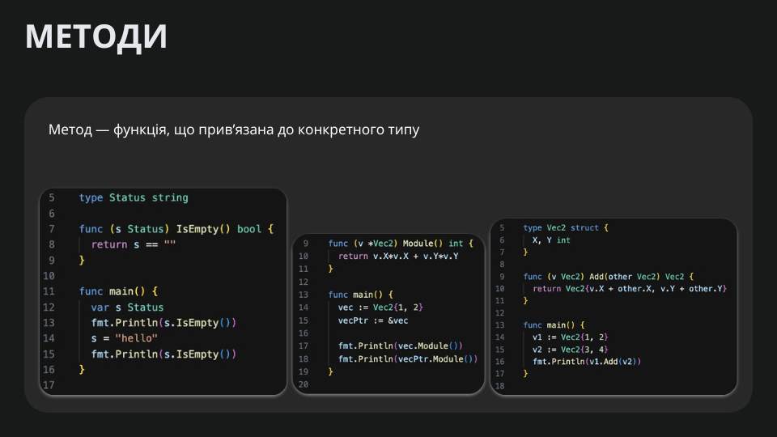
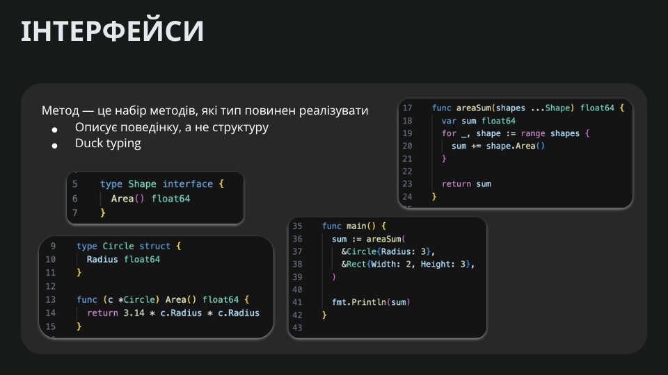
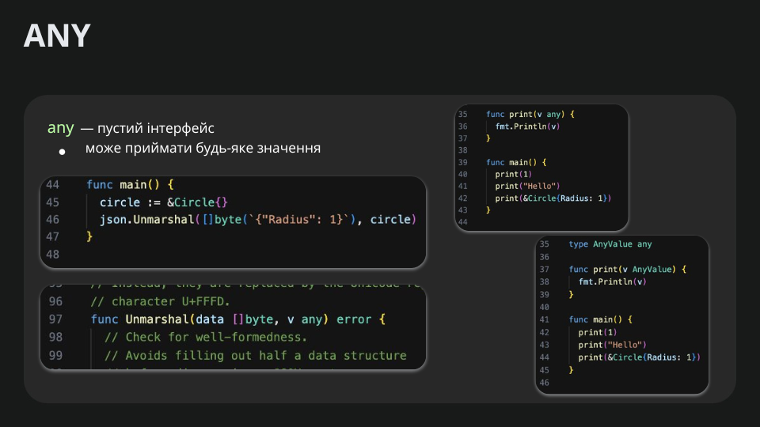
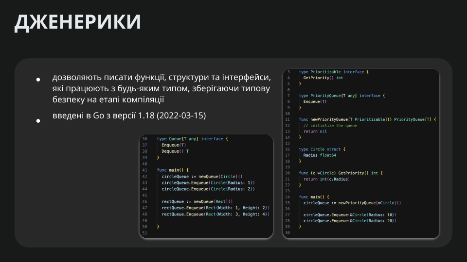

# Lesson 4: `Methods and Interfaces`

# Методи `Methods`



У мові програмування Go методи дозволяють прив’язати функції до певних типів, надаючи їм можливість поводитись як методи об'єктів. Це дає змогу організовувати код, розподіляючи функціональність між різними типами даних. Розглянемо основні моменти:

## **Оголошення методу**

Метод в Go оголошується як функція, до якої додається так званий рецептор (receiver) — змінна, що представляє тип, до якого прив’язується метод. Наприклад:

```go
package main

import "fmt"

type Person struct {
    Name string
    Age  int
}

// Метод із value receiver (значення копіюється)
func (p Person) Greet() {
    fmt.Printf("Привіт, мене звати %s і мені %d років.\n", p.Name, p.Age)
}

func main() {
    person := Person{Name: "Іван", Age: 30}
    person.Greet() // Виклик методу
}
```

## **Pointer Receiver vs Value Receiver**

- **Value Receiver**: Коли метод оголошено з value receiver, копія значення передається в метод. Це підходить, коли метод не змінює стан об’єкта.
- **Pointer Receiver**: Використовується для методів, які можуть змінити стан об’єкта, або коли тип великий і копіювання може бути неефективним. Наприклад:

```go
func (p *Person) CelebrateBirthday() {
    p.Age++
}
```

## **Використання методів для реалізації інтерфейсів**

Однією з ключових особливостей Go є імплементація інтерфейсів. Якщо тип реалізує всі методи інтерфейсу, він автоматично задовольняє його, без необхідності явного оголошення. Це дозволяє створювати гнучкі та легко розширювані системи.

## **Основні переваги використання методів у Go**

- **Читабельність та організація коду**: Методи групують логіку, що стосується конкретного типу, що робить код більш зрозумілим.
- **Інкапсуляція**: Хоча Go не підтримує повну інкапсуляцію, методи дозволяють обмежити доступ до даних через неекспортовані поля.
- **Простота реалізації інтерфейсів**: Завдяки методам Go забезпечує потужну систему інтерфейсів, що дозволяє писати більш універсальний код.

# Інтерфейси `Interfaces`



В Go інтерфейси є потужним механізмом для визначення поведінки об’єктів без необхідності явної ієрархії класів (як у мовах типу Java або C#). Інтерфейс визначає набір методів, які повинен реалізовувати певний тип, і якщо тип реалізує всі методи інтерфейсу, він автоматично задовольняє цей інтерфейс.

### **1. Оголошення інтерфейсу**

Інтерфейси оголошуються за допомогою ключового слова `interface`.

```go
package main

import "fmt"

// Визначаємо інтерфейс
type Speaker interface {
    Speak()
}

// Реалізуємо інтерфейс у структурі
type Person struct {
    Name string
}

// Метод Speak реалізований для Person
func (p Person) Speak() {
    fmt.Printf("Привіт! Я %s\n", p.Name)
}

func main() {
    var s Speaker // Оголошуємо змінну типу інтерфейсу
    p := Person{Name: "Іван"}
    s = p // Присвоюємо значення, оскільки Person реалізує Speaker
    s.Speak()
}
```

👉 Go автоматично визначає, чи реалізує тип інтерфейс, тобто не потрібно явно вказувати, що `Person` реалізує `Speaker`.

### **2. Інтерфейси з кількома методами**

Інтерфейс може містити декілька методів:

```go
type Animal interface {
    Speak()
    Move()
}

type Dog struct {
    Name string
}

func (d Dog) Speak() {
    fmt.Println("Гав-гав!")
}

func (d Dog) Move() {
    fmt.Println("Собака біжить!")
}

func main() {
    var a Animal
    a = Dog{Name: "Рекс"}
    a.Speak() // Виведе "Гав-гав!"
    a.Move()  // Виведе "Собака біжить!"
}
```

### **3. Інтерфейси з pointer receiver**

Якщо методи інтерфейсу приймають `pointer receiver`, то для їх виклику потрібно використовувати саме вказівник:

```go
type Counter interface {
    Increment()
    GetValue() int
}

type Number struct {
    value int
}

// Використання pointer receiver дозволяє змінювати значення
func (n *Number) Increment() {
    n.value++
}

func (n Number) GetValue() int {
    return n.value
}

func main() {
    var c Counter
    num := Number{value: 5}

    // c = num ❌ Помилка, оскільки Increment має pointer receiver
    c = &num // ✅ Потрібно передати вказівник
    c.Increment()
    fmt.Println(c.GetValue()) // Виведе 6
}
```

### **4. Порожній інтерфейс (`interface{}`)**

Інтерфейс `interface{}` (або `any` у Go 1.18+) є універсальним та може містити значення будь-якого типу:

```go
func PrintValue(value interface{}) {
    fmt.Println("Value:", value)
}

func main() {
    PrintValue(42)
    PrintValue("Привіт, світ!")
    PrintValue([]int{1, 2, 3})
}
```

Однак, для використання значень потрібно `type assertion` або `type switch`:

```go
func Describe(i interface{}) {
    switch v := i.(type) {
    case string:
        fmt.Println("Це рядок:", v)
    case int:
        fmt.Println("Це число:", v)
    default:
        fmt.Println("Невідомий тип")
    }
}

func main() {
    Describe("Hello")
    Describe(100)
    Describe(3.14)
}
```

### **5. Композиція інтерфейсів**

Go дозволяє створювати складні інтерфейси на основі інших:

```go
type Reader interface {
    Read() string
}

type Writer interface {
    Write(data string)
}

// Композиція інтерфейсів
type ReadWriter interface {
    Reader
    Writer
}
```

Тепер будь-який тип, який реалізує `Read` і `Write`, автоматично реалізовує `ReadWriter`.

### **6. Порожній інтерфейс як будь-який тип**

Інколи корисно приймати будь-який тип за допомогою `interface{}`:

```go
func PrintAnything(data interface{}) {
    fmt.Println(data)
}

func main() {
    PrintAnything(42)
    PrintAnything("Hello, World!")
    PrintAnything([]int{1, 2, 3})
}
```

Але Go 1.18+ надає кращий підхід — **узагальнені (generic) типи**.

### **7. Порівняння інтерфейсів у Go**

Інтерфейси можна порівнювати:

```go
var a, b Speaker
fmt.Println(a == b) // true, якщо обидва nil
```

Але якщо змінна містить `nil`-значення конкретного типу, вона не вважається `nil`:

```go
var p *Person
var s Speaker = p
fmt.Println(s == nil) // false
```

Щоб перевірити, чи інтерфейс має значення `nil`, потрібно перевірити його конкретний тип:

```go
if s == nil || (reflect.ValueOf(s).IsNil()) {
    fmt.Println("s дійсно nil")
}
```

# Any `Any`



## **Що таке `any` у Go?**

Починаючи з **Go 1.18**, з'явився новий псевдонім `any`, який є просто синонімом для `interface{}`. Це означає, що `any` може містити значення будь-якого типу, як і `interface{}.`

**Приклад використання `any`**

```go
package main

import "fmt"

func PrintValue(value any) {
    fmt.Println("Value:", value)
}

func main() {
    PrintValue(42)
    PrintValue("Hello, Go!")
    PrintValue([]int{1, 2, 3})
}
```

- ⚡ Важливо: `any` — це просто зручна заміна `interface{}`, тому ви можете використовувати його так само.

## **Чому введено `any`?**

До `Go 1.18` для визначення змінних, що можуть зберігати значення будь-якого типу, використовували `interface{}`:

```go
var value interface{} = "Hello"
```

Але таке позначення виглядає не дуже зручно, тому з’явився псевдонім `any`, що робить код більш зрозумілим:

```go
var value any = "Hello"
```

**Go team вирішила, що `any` краще відображає намір коду та робить його читабельнішим.**

## **Тип `any` та `Type Assertion`**

Оскільки `any` (як і `interface{}`) може містити значення будь-якого типу, потрібно **явно приводити його до потрібного типу перед використанням**:

```go
func Describe(value any) {
    str, ok := value.(string)
    if ok {
        fmt.Println("Це рядок:", str)
    } else {
        fmt.Println("Не рядок")
    }
}

func main() {
    Describe("Go")
    Describe(42)
}
```

## **Type assertion з перевіркою (`ok`)**

- Якщо приведення успішне, `ok` буде `true`.
- Якщо приведення невдале, `ok` буде `false`.

## **Тип `any` та `Type Switch`**

Якщо потрібно обробляти значення різних типів, можна використовувати `switch`:

```go
func IdentifyType(value any) {
    switch v := value.(type) {
    case string:
        fmt.Println("Це рядок:", v)
    case int:
        fmt.Println("Це число:", v)
    case bool:
        fmt.Println("Це булеве значення:", v)
    default:
        fmt.Println("Невідомий тип")
    }
}

func main() {
    IdentifyType("Hello")
    IdentifyType(100)
    IdentifyType(true)
}
```

## **Тип `any` у мапах, списках, структурах**

Оскільки `any` може містити будь-який тип, його зручно використовувати у структурах або динамічних колекціях.

Зберігання різних типів у `map[string]any`

```go
package main

import "fmt"

func main() {
    data := map[string]any{
        "name":    "Іван",
        "age":     30,
        "isAdmin": true,
    }

    fmt.Println(data["name"])  // Виведе: Іван
    fmt.Println(data["age"])   // Виведе: 30
    fmt.Println(data["isAdmin"]) // Виведе: true
}
```

### **Тип `any` та Generic-функції**

`Go 1.18` також додав generics, які часто використовуються разом із `any`. Наприклад:

```go
func PrintSlice[T any](items []T) {
    for _, item := range items {
        fmt.Println(item)
    }
}

func main() {
    PrintSlice([]int{1, 2, 3})
    PrintSlice([]string{"A", "B", "C"})
}
```

- ✅ Висновок: Generics — більш зручний підхід у багатьох випадках, де раніше використовували `any`.

## **Коли варто використовувати `any`?**

- ✅ Коли потрібно зберігати будь-який тип (наприклад, у `map[string]any`).
- ✅ Коли функція або метод повинні працювати з різними типами (`interface{}` раніше виконував цю роль).
- ✅ Коли потрібно передавати значення невідомого типу (наприклад, у логуваннях).
- ❌ Не варто використовувати any, якщо можна застосувати generics.

Підсумки

- `any` — це псевдонім для `interface{}`, який робить код читабельнішим.
- Використовується там, де потрібно працювати з довільними типами.
- Підтримує type assertion (`value.(string)`) та `type switch`.
- Краще використовувати generics, якщо можливо.

# **Дженерики `generics`**

  

## Що таке generics у Go?

Generics (узагальнені типи) були додані в `Go 1.18`, і вони дозволяють писати функції та структури, які можуть працювати з будь-якими типами без втрати типобезпеки. Раніше, щоб зробити функцію універсальною, доводилося використовувати `interface{}` або створювати кілька варіантів однієї функції для різних типів.

Generics дозволяють визначати узагальнені (generic) типи, які можуть бути замінені конкретними типами під час компіляції.

## **1. Синтаксис generic-функцій**

Generic-функція визначається за допомогою **параметра типу `T`**, який зазначається в квадратних дужках `[]` перед списком параметрів функції:

```go
package main

import "fmt"

// Узагальнена функція, яка приймає будь-який тип T
func PrintValue[T any](value T) {
    fmt.Println("Value:", value)
}

func main() {
    PrintValue(42)        // Виведе: Value: 42
    PrintValue("Hello")   // Виведе: Value: Hello
    PrintValue(true)      // Виведе: Value: true
}
```

- Тут `[T any]` означає, що `T` — це узагальнений тип, який може бути будь-яким (`any` — це псевдонім для `interface{}`).

## **2. Generic-функція для роботи з масивами**

```go
func PrintSlice[T any](items []T) {
    for _, item := range items {
        fmt.Println(item)
    }
}

func main() {
    PrintSlice([]int{1, 2, 3})          // Працює з int
    PrintSlice([]string{"A", "B", "C"}) // Працює з string
}
```

- ✅ Ця функція працює як для `[]int`, так і для `[]string`, не потребуючи дублікації коду.

## **3. Використання кількох типів у generics**

Generic-функції можуть приймати кілька узагальнених типів:

```go
func Pair[T, U any](first T, second U) {
    fmt.Printf("First: %v, Second: %v\n", first, second)
}

func main() {
    Pair(42, "Hello")  // First: 42, Second: Hello
    Pair(true, 3.14)   // First: true, Second: 3.14
}
```

- Тут `[T, U any]` означає, що `T` і `U` можуть бути будь-якими типами.

## **4. Обмеження типів (type constraints)**

Якщо потрібно обмежити generic-тип лише числами (int, float), можна використати `constraints` з пакета golang.org/x/exp/constraints або створити власний інтерфейс:

```go
import "golang.org/x/exp/constraints"

// Обмежуємо типи тільки числами
func Sum[T constraints.Ordered](a, b T) T {
    return a + b
}

func main() {
    fmt.Println(Sum(3, 5))      // 8 (int)
    fmt.Println(Sum(2.5, 3.5))  // 6 (float)
}
```

-✅ `constraints.Ordered` означає, що `T` може бути лише числовим (`int`, `float` або `string`).

## **5. Узагальнені (generic) структури**

Generics працюють не тільки у функціях, а й у структурах:

```go
type Box[T any] struct {
    value T
}

func (b Box[T]) GetValue() T {
    return b.value
}

func main() {
    intBox := Box[int]{value: 100}
    stringBox := Box[string]{value: "Hello"}

    fmt.Println(intBox.GetValue())   // 100
    fmt.Println(stringBox.GetValue()) // Hello
}
```

- ✅ Так можна створювати узагальнені контейнери, що працюють з будь-якими типами.

## **6. Узагальнені (generic) методи**

Методи також можуть бути узагальненими:

```go
type Container[T any] struct {
    items []T
}

func (c *Container[T]) Add(item T) {
    c.items = append(c.items, item)
}

func (c Container[T]) GetAll() []T {
    return c.items
}

func main() {
    numbers := Container[int]{}
    numbers.Add(10)
    numbers.Add(20)
    
    fmt.Println(numbers.GetAll()) // [10 20]
}
```

- ✅ `Container[int]` працює тільки з `int`, але можна створити `Container[string]` для збереження рядків.

### **Висновки**

- ✅ Generics дозволяють створювати універсальні функції та структури без втрати типобезпеки.
- ✅ Можна обмежувати типи за допомогою constraints (constraints.Ordered).
- ✅ Generics усувають необхідність використання interface{} (any) для узагальнених функцій.
- ✅ Generics покращують продуктивність, оскільки компілятор підставляє конкретні типи.
- ✅ Підтримується для функцій, структур, методів.
