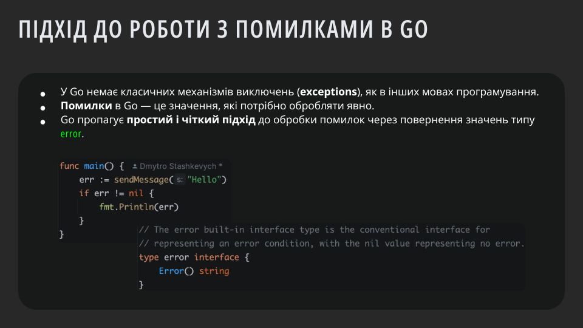
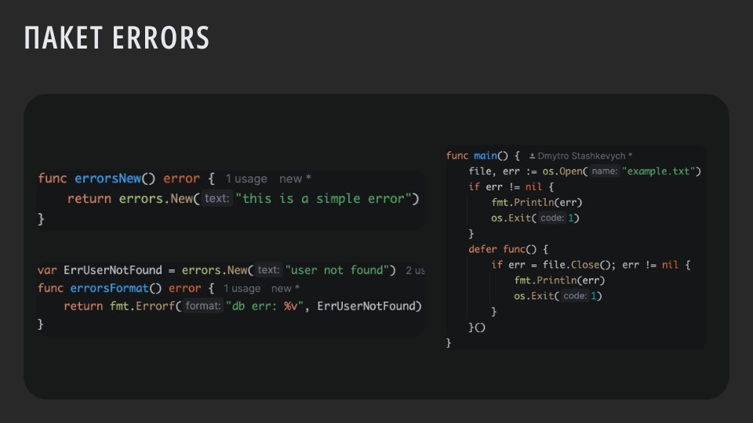
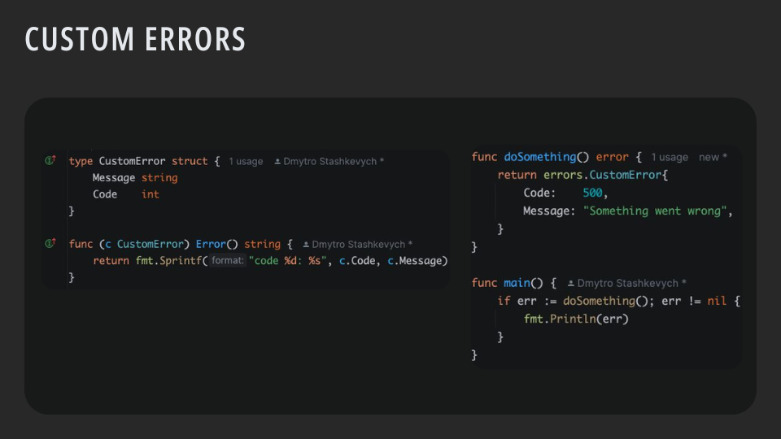
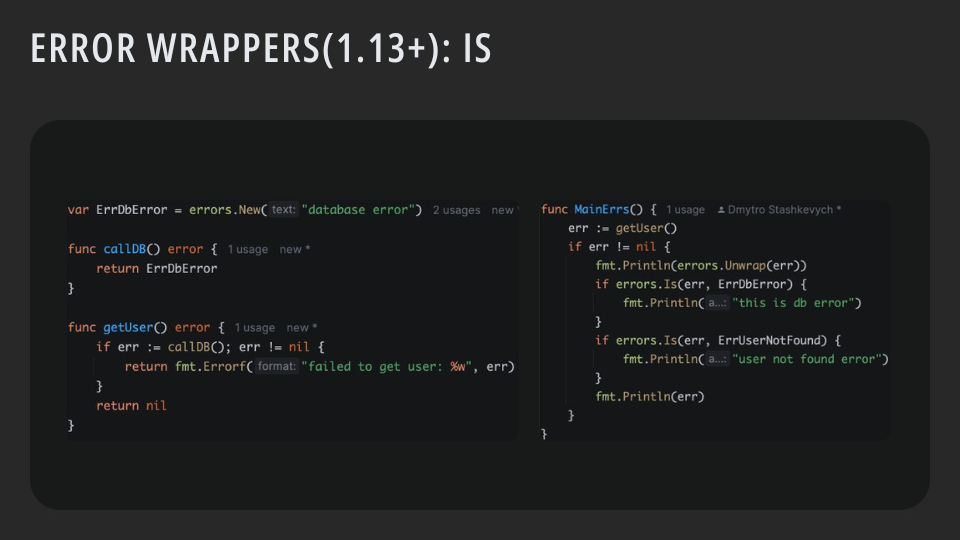
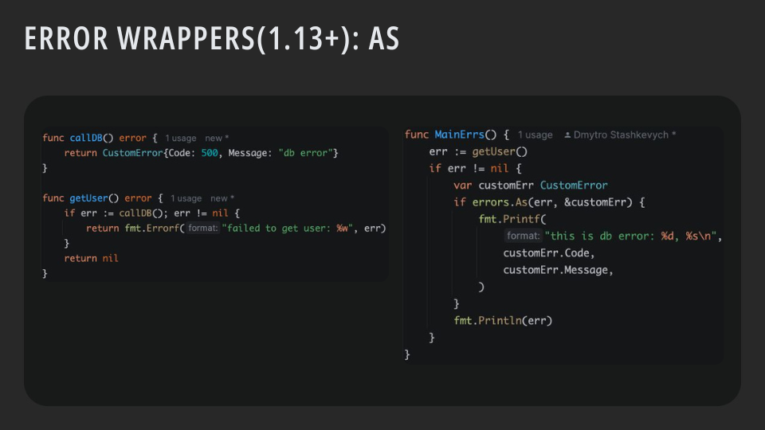
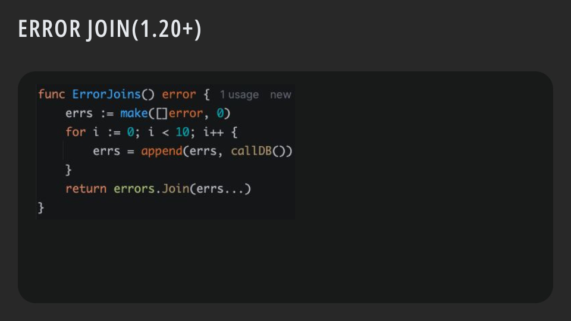
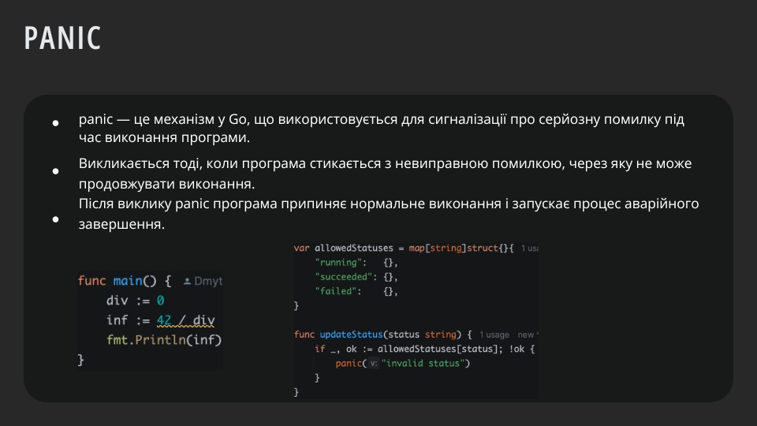
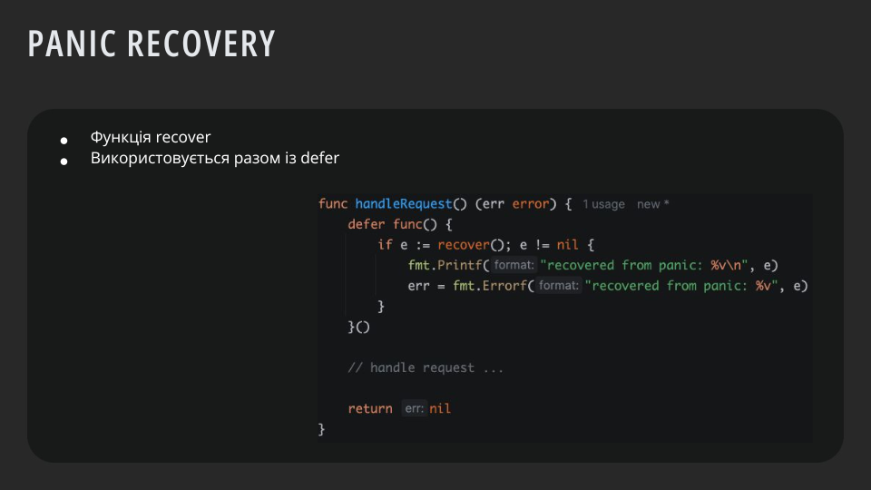

# Lesson 5 Обробка помилок
## Підхід до роботи з помилками в Go


🔹 Підхід до роботи з помилками в Go

## ✅ 1. Помилка — це значення
У Go помилки реалізовані як значення, що реалізують інтерфейс:

```go
type error interface {
    Error() string
}
```
Тобто будь-який тип, який має метод `Error() string`, вважається помилкою.

## ✅ 2. Явна перевірка помилки
При виклику функції, яка може повернути помилку, ти зобов'язаний її перевірити:

```go
err := sendMessage("Hello")
if err != nil {
    fmt.Println("Помилка:", err)
}
```
📌 Це спонукає писати надійний код, бо ти ніколи не можеш "забути" обробити помилку.

## ✅ 3. Функції повертають error як другий (часто останній) аргумент
```go
func doSomething() (string, error) {
    if fail {
        return "", errors.New("щось пішло не так")
    }
    return "успіх", nil
}
```
### 🛠 Приклади кращої практики
## 🔸 Обгортання помилок для кращого контексту
```go
return fmt.Errorf("cannot send message: %w", err)
```
### 🔸 Використання `errors.Is()`
```go
if errors.Is(err, ErrNotFound) {
    // Специфічна обробка
}
```
## 🔸 Використання `errors.As()`
```go
var customErr *MyCustomError
if errors.As(err, &customErr) {
    // Обробка кастомної помилки
}
```
### ⚠️ Чому так зроблено?
-  Go уникає прихованих помилок через винятки, як це буває в Java, Python або JS.
-  Такий підхід спрощує відлагодження, зменшує "магію" та підвищує надійність.

> **_NOTE:_**💡 Dev philosophy Go: "Якщо помилка трапилася — покажи її відразу. Будь чесним."

# Пакет `errors `


Пакет `errors` є стандартним інструментом для створення та роботи з помилками у Go. Його основна ідея — простота та прозорість.

## ✅ 1. Створення простої помилки – errors.New
📌 Функція errors.New() створює просту помилку з повідомленням.

```go
func errorsNew() error {
    return errors.New("this is a simple error")
}
```
🔍 Пояснення:

- Повертається тип `error`.
- Створена помилка не містить вкладених помилок або додаткового контексту.
- Ідеально підходить для фіксованих помилок (наприклад: "permission denied", "not found").

## ✅ 2. Форматування помилок – `fmt.Errorf`
📌 Якщо потрібно надати додатковий контекст до помилки, використовуй fmt.Errorf.

```go
var ErrUserNotFound = errors.New("user not found")

func errorsFormat() error {
    return fmt.Errorf("db err: %v", ErrUserNotFound)
}
```
🧠 Пояснення:

- `%v` вставляє текстове представлення `ErrUserNotFound`.
- Але ця помилка не є обгорнутою — `errors.Is()` не спрацює.
- Якщо потрібно передавати вкладену помилку, використовуй `%w`.

```go
return fmt.Errorf("db err: %w", ErrUserNotFound) // Тепер можна перевірити через errors.Is()
```
## ✅ 3. Обгортання помилок — `%w` у `fmt.Errorf`
📌 %w обгортає помилку — дає змогу зберігати її тип.

```go
return fmt.Errorf("context info: %w", ErrUserNotFound)
```
➡️ Це дає змогу в іншому місці коду виконати:

```go
if errors.Is(err, ErrUserNotFound) {
    // специфічна обробка
}
```
## ✅ 4. Гарна практика: закриття ресурсів з обробкою помилки

```go
defer func() {
    if err := file.Close(); err != nil {
        fmt.Println(err)
        os.Exit(1)
    }
}()
```
📌 Це гарантує, що файл буде закритий незалежно від того, як завершиться функція `main().`

🧩 Загальна структура для роботи з помилками
```go
func doSomething() error {
    file, err := os.Open("example.txt")
    if err != nil {
        return fmt.Errorf("cannot open file: %w", err)
    }
    defer file.Close()

    // ... робота з файлом ...

    return nil
}
```
🎯 Висновок

- `errors.New("msg")`	Створення простої помилки
- `fmt.Errorf("text: %w", err)`	Обгортання помилки з контекстом
- `errors.Is(err, target)`	Перевірка вкладеної помилки
- `errors.As(err, &targetType)`	Отримання конкретного типу помилки
- `errors.Unwrap(err)`	Дістає вкладену помилку з обгортки


# Custom Errors


🎨 Custom Errors у Go (Користувацькі помилки)
🔹 Навіщо це потрібно?
- Додаткова інформація: код, поле, лог рівень тощо.
- Можливість обробляти помилки специфічного типу (errors.As).
- Краще логування або UI-відповіді в API.

## ✅ 1. Створення власного типу помилки

```go
type CustomError struct {
    Message string
    Code    int
}
```
Це просто структура, яка містить додаткові поля.

## ✅ 2. Реалізація інтерфейсу `error`
Щоб тип вважався помилкою, потрібно реалізувати метод:

```go
func (c CustomError) Error() string {
    return fmt.Sprintf("code %d: %s", c.Code, c.Message)
}
```
🔔 Метод `Error()` — це те, що побачить `fmt.Println(err)`

## ✅ 3. Використання кастомної помилки
```go
func doSomething() error {
    return CustomError{
        Code:    500,
        Message: "Something went wrong",
    }
}

func main() {
    if err := doSomething(); err != nil {
        fmt.Println(err) // Виведе: code 500: Something went wrong
    }
}
```
## 🔍 4. Вилучення кастомної помилки через errors.As()
```go
func main() {
    err := doSomething()

    var customErr CustomError
    if errors.As(err, &customErr) {
        fmt.Printf("Handle error with code: %d\n", customErr.Code)
    }
}
```
✅ Це дозволяє перевірити й дістати поля без приведення типів вручну.

## 🛠 Альтернатива: вказівник
Якщо хочеш мати можливість використовувати `errors.Is()` чи зберігати референс на помилку:

```go
func (c *CustomError) Error() string {
    return fmt.Sprintf("code %d: %s", c.Code, c.Message)
}
```
Тоді функція має повертати` &CustomError{...}`.

🎯 Резюме

- `type MyError struct`	Створення власного типу помилки
- `func (e MyError) Error() string`	Реалізація інтерфейсу error
- `return MyError{...}`	Повернення помилки
- `errors.As(err, &myErr)`	Витяг конкретного типу помилки


# 🧵 Error Wrappers (Go 1.13+): errors.Is()

- 🔹 Що таке обгортання (wrapping) помилок?

Go дозволяє створювати “ланцюжок” помилок — коли одна помилка обгортає іншу, додаючи контекст, але зберігаючи суть.

```go
return fmt.Errorf("failed to get user: %w", err)
```
- `%w` означає: обгорнути помилку, щоб її можна було потім дістати через errors.Is() або errors.Unwrap().

## ✅ 1. Використання `errors.Is(err, target)`
```go
if errors.Is(err, ErrDbError) {
    fmt.Println("this is db error")
}
```
🔍 Це перевірка, чи міститься в ланцюжку помилок `ErrDbError`.

Працює навіть якщо ми її обгорнули кілька разів:

```go
return fmt.Errorf("1st wrap: %w", fmt.Errorf("2nd wrap: %w", ErrDbError))
```

## ✅ 2. Приклад на твоєму коді (пояснення)
```go
var ErrDbError = errors.New("database error")

func callDB() error {
    return ErrDbError
}

func getUser() error {
    if err := callDB(); err != nil {
        return fmt.Errorf("failed to get user: %w", err)
    }
    return nil
}
```
Потім:

```go
err := getUser()

if errors.Is(err, ErrDbError) {
    fmt.Println("this is db error")
}
```
➡️ Хоча `getUser()` повертає обгорнуту помилку, `errors.Is()` “розпаковує” її, порівнюючи вкладену.

🧩 3. Пояснення `Unwrap()`
Іноді ти хочеш явно дістати “внутрішню” помилку:

```go
baseErr := errors.Unwrap(err)
fmt.Println(baseErr) // Виведе: database error
```
### 🧠 Навіщо це потрібно?

- Обробка відомих помилок	`errors.Is(err, ErrPermissionDenied)`
- Розбір кастомних помилок	`errors.As(err, *MyCustomError)`
- Додавання контексту до помилки	`fmt.Errorf("some context: %w", err)`
### 🎯 Висновки
- ✅ `fmt.Errorf("...: %w", err)` — обгортає помилку
- ✅ `errors.Is(err, target)` — перевіряє, чи є target серед вкладених помилок
- ✅ `errors.Unwrap(err`) — дістає першу вкладену помилку (можна "розмотувати" вручну)
- ✅ Працює рекурсивно: `errors.Is()` перевіряє всі рівні вкладень

# Error Wrappers (Go 1.13+): `errors.As()`


- Що таке errors.As()?
Це функція, яка дозволяє перевірити, чи обгорнута помилка є певного типу — і достати її.

## ✅ 1. Синтаксис `errors.As(err, &target)`
```go
var myErr MyError
if errors.As(err, &myErr) {
    // тепер можна використовувати поля з myErr
}
```
☑️ &myErr має бути вказівником на тип (або інтерфейс), що реалізує error.

## ✅ 2. Приклад з твого коду
🧱 Створення кастомної помилки:
```go
type CustomError struct {
    Code    int
    Message string
}

func (c CustomError) Error() string {
    return fmt.Sprintf("code %d: %s", c.Code, c.Message)
}
```
🔁 Обгортання помилки:
```go
func getUser() error {
    if err := callDB(); err != nil {
        return fmt.Errorf("failed to get user: %w", err)
    }
    return nil
}
```
`%w` обгортає `CustomError` всередині `fmt.Errorf`.

## 🔍 Витяг типу помилки через `errors.As()`
```go
var customErr CustomError
if errors.As(err, &customErr) {
    fmt.Printf("this is db error: %d, %s\n", customErr.Code, customErr.Message)
}
```
🔎 Go пройде по ланцюжку обгорнутих помилок, знайде `CustomError`, і присвоїть його в `customErr`.

💡 Для чого використовувати `As()`?

- Хочеш дістати додаткові поля помилки	`errors.As()`
- Помилка має спеціальний тип (наприклад, ValidationError)	`errors.As()`
- Потрібна кастомна логіка на основі коду	`errors.As()` дає доступ до `.Code` тощо


# `errors.Join()` — Go 1.20+


📌 Що це?

Функція `errors.Join(errs...)` дозволяє об'єднати декілька помилок в одну. Це зручно, коли виникає кілька помилок одночасно, наприклад:

- перевірка кількох валідаційних умов,
- кілька запитів до бази,
- кілька API-викликів тощо.

## ✅ Синтаксис
```go
return errors.Join(err1, err2, err3)
```
Якщо всі `err == nil`, то `errors.Join()` поверне `nil`.

## ✅ Приклад з твого скріншоту
```go
func ErrorJoins() error {
    errs := make([]error, 0)
    for i := 0; i < 10; i++ {
        errs = append(errs, callDB()) // callDB() повертає помилки
    }
    return errors.Join(errs...)
}
```
🔍 Цей приклад збирає 10 помилок (умовно) та обʼєднує їх в одну.

### 🔎 Робота з обʼєднаними помилками
🔸 `errors.Is()`

Перевіряє, чи будь-яка з обʼєднаних помилок є цільовою:

```go
if errors.Is(err, ErrDbError) {
    fmt.Println("At least one DB error occurred")
}
```
🔸 `errors.As()`

Можна знайти будь-яку конкретну помилку певного типу серед усіх з'єднаних:

```go
var cerr CustomError
if errors.As(err, &cerr) {
    fmt.Println("Custom error detected:", cerr.Code)
}
```

🎯 Висновок
- `errors.Join()` — нова зручна фіча в Go 1.20+
- Обʼєднує кілька помилок в одну
- Працює з `Is`, `As`, `Unwrap`
- Повертає `nil`, якщо всі передані помилки — `nil`


## panic


### ⚠️ panic у Go — аварійне завершення виконання

panic — це механізм у Go для сигналізації про фатальну помилку, яка перериває виконання програми.

- Після виклику panic, Go:
- Прекращає звичайне виконання.
- Запускає відкладені (defer) функції.
- Виводить stack trace.
- Завершує програму.

## ✅ Коли варто використовувати panic

- `Програмна помилка`	Щось, що ніколи не повинно статися (наприклад, ділення на 0, або недопустимий enum)
- `Неможливість відновлення`	Зламаний інваріант, невірна конфігурація, критичний assert
- `Внутрішні помилки`	У бібліотеках або під час генерації коду
## 📌 Приклад 1: ділення на нуль
```go
func main() {
	div := 0
	inf := 42 / div // panic: integer divide by zero
	fmt.Println(inf)
}
```
🔴 Результат: Go викликає panic, бо ділення на нуль — фатальна помилка для цілого типу.

## 📌 Приклад 2: обмежене значення (enum / whitelist)
```go
var allowedStatuses = map[string]struct{}{
	"running":   {},
	"succeeded": {},
	"failed":    {},
}

func updateStatus(status string) {
	if _, ok := allowedStatuses[status]; !ok {
		panic("invalid status") // порушення логіки програми
	}
}
```
🔴 Тут panic застосовується, якщо передано неприпустиме значення. Це часто використовують для перевірки інваріантів.

## 🧵 Як працює з defer
```go
func main() {
	defer fmt.Println("defer executed")
	panic("fatal error")
}
```
🔸 Перед завершенням panic, виконаються всі defer-блоки — це дає шанс звільнити ресурси або записати лог.

## 🛡 Як відновити виконання — recover()
Go надає можливість перехопити panic і відновити виконання програми:

```go
func safeFunc() {
	defer func() {
		if r := recover(); r != nil {
			fmt.Println("Recovered from panic:", r)
		}
	}()
	panic("boom!")
}
```
📌 Використовується рідко, зазвичай — у middleware, горутинах або фреймворках.

❌ Коли не варто використовувати panic

- `Очікувана помилка`	Повернути error
- `Некоректний ввід`	Валідація + error
- `Робота з файлами, мережею, БД`	error перевірка — завжди краще ніж panic
## ✅ Висновок
- `panic` — це інструмент для фатальних, невиправних помилок
- Викликає аварійне завершення, але спочатку виконує всі `defer`
- Може бути перехоплений через `recover()`
- Використовуй з обережністю: тільки тоді, коли програма не може продовжити роботу


## PANIC RECOVERY

🛡️ Функція `recover()` у Go

`recover()` — це вбудована функція Go, яка дозволяє перехопити panic всередині `defer`-функції.

✅ Якщо її викликати поза `defer`, вона повертає `nil` і нічого не робить.

## ✅ Типовий шаблон використання:
```go
func safeFunc() {
	defer func() {
		if r := recover(); r != nil {
			fmt.Println("Recovered from panic:", r)
		}
	}()
	
	panic("boom!") // буде перехоплено
}
```
📌 Після виклику panic, recover() зчитує його значення, зупиняє аварійне завершення — і код продовжує працювати.

## ✅ Приклад із поверненням `error`
```go
func handleRequest() (err error) {
	defer func() {
		if e := recover(); e != nil {
			fmt.Printf("recovered from panic: %v\n", e)
			err = fmt.Errorf("recovered from panic: %v", e)
		}
	}()
	
	// ... тут може трапитись panic ...
	
	return nil
}
```
🔍 Пояснення:

- `err` оголошено як іменований результат — це дає змогу встановити його значення всередині `defer`.
- Якщо трапиться `panic`, він буде перехоплений і перетворений у `error`.
- Функція завершиться нормально, не впаде.

📦 Use-case: Middleware для HTTP-серверів
```go
func RecoverMiddleware(next http.Handler) http.Handler {
	return http.HandlerFunc(func(w http.ResponseWriter, r *http.Request) {
		defer func() {
			if r := recover(); r != nil {
				log.Printf("Recovered: %v", r)
				http.Error(w, "Internal Server Error", http.StatusInternalServerError)
			}
		}()
		next.ServeHTTP(w, r)
	})
}
```
📌 Один `panic` у `handler`'і не зруйнує весь сервер — просто повернеться 500.

⚠️ Правила використання `recover()`
Правило	Пояснення
- ✅ Використовуй тільки в defer	Інакше recover() нічого не зробить
- ✅ Перетворюй panic на error, якщо логіка цього потребує	
- ❌ Не лови panic, якщо не впевнений, що знаєш, як з нею впоратись	
- ❌ Не ховай серйозні помилки, які варто виправити	

🧠 Висновок
- `recover()` — інструмент для контрольованого перехоплення panic
- Працює тільки в парі з `defer`
- Дозволяє перетворити panic у помилку
- Класичне застосування: обгортки, middleware, горутини